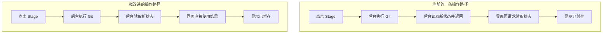

# 架构与开发约定

本文维护 AlwayGit 的运行结构、代码入口、跨层约定和开发流程。产品行为以 [工作台规格](WORKBENCH_SPEC.md) 为准，检查方法和验证证据见 [验证与本地更新](VALIDATION.md)，协作要求见 [项目规则](../AGENTS.md)。

## 运行结构

AlwayGit 是 Workspace 类型的 VS Code 扩展。每个 React WebviewPanel 提供一个独立工作台标签，Node.js 扩展宿主管理面板集合，并共享 Git 子进程、仓库发现、剪贴板、窗口和文件操作。Webview 不直接读取磁盘，也不执行 Git。

`src/protocol` 是 Webview 和宿主的共享边界。请求以 `id` 关联响应，Zod 在宿主入口验证方法与参数；宿主主动发布仓库变更、操作活动和仓库选择事件。宿主只接受已经注册的仓库及预定义方法，不暴露任意命令执行接口。

## 模块边界

| 目录 | 主要入口 | 职责 |
| --- | --- | --- |
| `src/extension` | `extension.ts`、`workbench.ts`、`project-windows.ts` | 扩展激活、面板集合、RPC 路由、VS Code 命令和生命周期 |
| `src/application` | `confirm.ts`、`credentials.ts`、`window-bridge.ts`、`logging.ts` | 操作确认、认证与窗口 IPC、日志脱敏和用例协调 |
| `src/git` | `service.ts`、`default-branch.ts` | 系统 Git 执行、结构化解析、查询、操作及共享仓库队列 |
| `src/repositories` | `manager.ts`、`discovery.ts` | 仓库注册、递归发现、文件监听和持久化 |
| `src/editor` | `paths.ts`、`documents.ts` | 安全路径解析、Git 内容文档、只读预览和 VS Code 原生 Diff |
| `src/protocol` | `types.ts`、`validation.ts`、`repositories.ts` | 数据模型、RPC 请求响应、运行时校验和仓库展示分组 |
| `webview` | `App.tsx`、`store.ts`、`rpc.ts` | React 组合、Zustand 状态、宿主桥接和 Demo |
| `webview` | `Sidebar.tsx`、`History.tsx`、`Details.tsx`、`DiffPreview.tsx` | 四区呈现、对象选择和只读比较 |
| `webview` | `menus.ts`、`SettingsDialog.tsx`、`appearance.ts`、`i18n.ts` | 动作定义、界面设置、外观和语言 |
| `webview` | `refresh.ts`、`fileSelection.ts`、`commitSelection.ts`、`diff.ts` | 刷新失效范围、选择规则和修改块导航 |
| `webview/graph` | `layout.ts`、`GraphRow.tsx`、`palettes.ts` | 可分页的轨道布局、SVG 行渲染和配色 |

共享协议先于两端实现修改。新增宿主能力时，应依次维护共享类型与校验、宿主路由、Git 或编辑器实现、Webview 调用和真实仓库测试。Webview 菜单及工具栏应复用相同的动作描述和执行入口，避免同一 Git 操作出现不同参数或禁用规则。

## 仓库、引用和历史

Repository 标识工作目录，`commonDir` 标识共享 Git 存储。同一存储的多个 Worktree 共用写操作队列，但保持独立的 HEAD、Index 和工作区状态。写操作在执行前重新验证仓库、引用和 Worktree 状态。

Git 发现比较 Git 目录与共享目录识别主工作目录；linked Worktree 使用 `worktree list` 返回的主目录维护可选 `mainRoot`，独立存储的普通仓库仍使用自身工作目录。不根据 `.git` 文件类型或远端 URL 推断归属。共享纯函数 `src/protocol/repositories.ts` 按规范化 `commonDir` 派生逻辑仓库，供 Workbench 仓库导航使用；活动工作目录仍为实际操作目标。用户创建的 Repository Collection 是独立的展示层级，以逻辑仓库键保存归属；没有 Collection 的仓库直接位于根层，不生成特殊的“未分组”节点。RepositoryManager 和 RPC 保留完整工作目录列表及原路径 ID，旧保存路径、会话和草稿无需重写；扫描数量以逻辑仓库计数，新增 Worktree 即使不增加仓库数也发布列表变化。

手动添加目录由 `src/repositories/discovery.ts` 使用异步迭代遍历，仅对有 `.git` 标记的候选目录调用 Git 验证，并在有效仓库处停止深入。发现阶段不注册监听或写入状态；宿主显示逻辑仓库级多选结果，用户确认后 RepositoryManager 才批量去重、注册监听、保存和发布一次列表变更。已有自定义分组时，确认前可选择目标分组或仓库根层。扫描取消或关闭确认列表均不注册。用户主动添加的仓库路径、Collection 和归属保存在扩展 `globalState` 中，在同一 VS Code Profile 和运行环境的窗口间共享；首次启动会合并旧 `workspaceState` 路径完成兼容迁移。移除仓库会释放其监听、删除保存路径和分组归属并保存逻辑仓库排除项，防止工作区或内置 Git 自动发现立即恢复；再次明确添加时解除排除。启动恢复只重新验证已保存路径及 VS Code 提供的仓库，不重复递归扫描分类目录。本地路径不参与 Settings Sync。

Status 使用 porcelain v2 与 NUL 分隔，分别保存 Index 和工作区状态。历史查询接受一组完整引用名；首次查询固定 tips，后续分页沿用同一组 tips，避免翻页过程中引用移动造成重复或遗漏。多个引用的结果使用 Git 可达提交并集，共同祖先只返回一次。图算法的 pending lanes 跨页延续，虚拟列表只渲染可见行。

前端对异步请求使用仓库代数和请求代数，忽略切换仓库、刷新或重新筛选后返回的旧响应。宿主 Snapshot 具有单调版本，补偿刷新使用不含版本字段的指纹识别实际变化。文件监听携带相对工作区路径和 Index 变化标记，宿主与前端的防抖均合并变化范围；重叠 Snapshot 请求沿用尚未消费的变化范围，避免遗漏已处于 dirty 状态的文件内容更新。

后台刷新只在已选引用的 OID 或选择范围变化时重读 History；手动 Refresh 仍重新查询 History。已加载的 Commit 详情按仓库、OID 和所选 Parent 保留，History 查询不重新选择同一个 Commit。Merge Parent 作为可选会话字段保存，兼容既有 version 2 会话。

## 工作台状态

状态分为三类：

- 仓库数据：Snapshot、History 页面、Commit 详情和 Diff 预览。
- 每仓库视图：已勾选引用、引用目录展开状态、侧栏分区折叠状态、搜索、当前 Commit、文件、Stash、活动区域和 Commit 草稿。
- 全局界面：语言、主题、可编辑的浅色/深色 Graph 色板与主线颜色、界面与 Diff 字号、密度、面板尺寸和表格列宽。

会话写入各自的 VS Code Webview state，并由扩展宿主把最近状态保存到 `workspaceState` 作为新标签和兼容恢复的基线。多个标签具有独立的活动仓库与前端选择状态；宿主按请求来源定向响应和切换仓库，仓库变化与 Git 活动事件广播到全部标签。补偿刷新覆盖所有可见标签当前仓库，并按仓库去重。Demo 模式使用浏览器 localStorage。持久化的数据只包含界面状态，不包含凭据、Git 输出或文件内容。

version 2 会话通过可选 `appearance` 字段兼容新增设置，宿主协议验证后保留；旧会话缺少自定义色值时使用当前预设生成完整浅色/深色色板。旧 Editor Focus 迁移为 Workbench，旧默认 26 px 行高迁移为 24 px，其余尺寸和草稿保留。设置浮窗使用内存基线实现实时预览，订阅持久化时仍写入基线，应用后才保存新值；取消只恢复设置，不覆盖刷新后的仓库数据。虚拟列表尺寸由实际字号与密度共同决定。

Git 操作反馈以仓库 ID 保存在前端内存中，操作序号用于避免旧结果替换新操作；仓库切换只展示对应仓库的反馈。错误和结果不写入会话。文件批量选择属于当前文件区域的临时状态，与 Diff 预览目标分离；区域切换或文件消失时重新核对选择。

右键菜单保存目标对象的稳定身份及仓库 ID。打开操作对话框后，Git 写操作仍在宿主重新解析和验证引用、Stash 或 Worktree；切换仓库会关闭旧菜单和旧对话框。菜单以标准 `menu` / `menuitem` 语义呈现，支持焦点移动、Enter、Space、Escape 和点击外部关闭。

## Diff 与原生编辑器

工作台底部 Diff 是只读预览。请求携带明确的比较目标，例如 Working Tree 与 Index、Index 与 HEAD、Commit 与所选父提交。宿主读取限定仓库中的内容；每侧最多读取 256 KiB、呈现 4000 行，并返回截断或二进制说明。完整比较仍通过 VS Code 原生 Diff 打开，Git 文本文档的内容上限为 8 MB；工作区文件使用真实文件 URI，可继续在普通编辑器中修改。

Diff 的加载依赖比较目标的语义身份。历史比较不依赖 Snapshot 版本；工作区比较使用独立的内容刷新代数，根据所选文件路径、Index、相关状态与 Staged 比较的 HEAD 变化失效。来源不明确的通知保守更新当前工作区比较。更新同一个比较时保留旧预览及滚动位置，只有切换比较目标才清空内容并回到顶部。

历史中的删除文件没有工作区实体，打开时使用只读 Git 内容。Merge Commit 必须明确比较父提交。冲突比较使用 Index Stage 2/3，并允许打开实际文件解决冲突。

`resolve-and-stage` 表达用户已人工处理后的 Git 标记与暂存，仍通过 `git add` 实现，不证明内容正确。`operationReview` 将当前 Index 写成不可变 Tree，扫描相对 HEAD 的暂存变更，并返回文件、标记行号、未扫描原因及宿主颁发的一次性确认 token。token 绑定工作目录身份、分支、HEAD、Tree 和操作控制文件；Continue 以及活动操作中的 Commit 在共享写队列内重新核对，普通 Stage/Abort 等写操作使已有 token 失效。确认后内容变化不能复用旧确认。每文件最多扫描 2 MiB、累计 16 MiB，未扫描内容必须向用户明确展示；标记检测只用于提醒，不做语义正确性保证。外部 Git 进程仍可能在最后检查与实际 Git 命令间竞争，Git 自身的 Index 锁及执行错误继续生效。

原生 Diff 和文件编辑请求先经项目窗口路由，再在接收方调用 `GitDocuments`；虚拟内容登记只存在于接收宿主。编辑器使用当前组与 `preview: false`，保留既有标签和工作台，避免新增侧边编辑器组。

## 项目窗口路由

`ProjectWindows` 通过 `WindowBridge` 登记每个扩展宿主的真实工作区目录和最近活动时间。登记位于系统临时目录，按 VS Code 数据/Profile、应用和宿主隔离；每个实例独立写入登记并定期续期，不写入仓库或工作台会话。Windows 路径规范化大小写并解析真实目录，Worktree 按工作目录区分。

窗口间使用带随机令牌的回环 IPC，只接受预定义请求并重新核对工作区归属和信任状态。匹配优先级为精确目录、包含项目的最长工作区目录、最近活动窗口。接收方调用原生 `workbench.action.focusWindow` 激活自己；旧版通过工作区身份复用已打开窗口，并核对焦点结果。发送方等待执行回执。没有可用目标时以 `vscode.openFolder` 打开项目新窗口并等待扩展登记，超时报告失败。Repository 或 Worktree 的“在新窗口打开 Workbench”始终创建独立项目窗口，待新宿主登记后发送受限的 `workbench` 请求，由目标窗口注册仓库并显示对应工作台。

## Git 操作、并发和错误

Git 使用参数数组与 `shell: false`，引用和路径额外校验，文件操作使用 literal pathspec。子进程有输出限制、超时和非交互编辑器；超时终止子进程树。外部 Git 不受内存队列控制，因此 Git 锁和实际返回结果仍是最终依据。

同一个 `commonDir` 同时只执行一个写操作，忙碌状态同步给该 Git 存储下所有已注册 Worktree。Checkout 在宿主检查当前分支、未提交修改、未解决冲突和 Worktree 占用。远程分支本地化使用完整 `refs/remotes/*` 来源和预期 OID；批量创建在任何写入前验证全部本地名称、upstream、符号引用与层级冲突，单项创建并切换通过带 `--track` 的 `switch -c` 原子建立本地分支和跟踪关系。`Stash Changes & Checkout` 的 Stash 与 Checkout 分别报告结果；若远程分支 Checkout 受阻，重试保留原来源、名称和 OID；若 Stash 成功但 Checkout 失败，保留 Stash，不隐式恢复或删除。

Fetch、Pull 和 Push 沿用系统 Git Credential Helper、SSH Agent 和配置。需要输入时，使用每条命令独立的回环 IPC AskPass 桥接到 VS Code 输入框。桥接使用随机令牌并在命令结束后关闭；凭据不持久化，也不传到 Webview。日志与前端错误隐藏 URL 中的认证信息。

Snapshot 为当前分支解析 Push 目标，依次考虑 `branch.<name>.pushRemote`、`remote.pushDefault`、分支 remote、upstream 和唯一远端，并把本地分支、远端分支及 upstream 状态作为结构化数据交给 Webview。Push 对话框提交明确的本地与远端 refspec；远端分支名可以与本地分支名不同。首次建立跟踪时才请求 `--set-upstream`，已有 upstream 的普通 Push 不隐式改变跟踪关系。

高风险操作由宿主执行明确确认。提交遇到未保存编辑器内容时说明 Git 提交的是 Index。Git hooks、签名、认证和网络错误反馈真实失败，不尝试绕过。

## 安全边界

未受信任工作区不执行 Git。Webview 使用 CSP、脚本 nonce 和受限资源目录。工作区文件打开会校验目录边界和符号链接祖先；只有已注册的非 Bare Worktree 可通过工作台打开。剪贴板和新窗口操作由宿主处理，Webview 只提交经过协议约束的数据。

## 开发流程与文档维护

1. 阅读 README、相关工作台规格和本文，检查 `git status --short`；保留现有未提交修改。
2. 对照当前行为界定改动。同一需求的相关修改集中完成，独立功能或问题分别提交；仅已确认的问题进入 [问题日志](ISSUES.md)。
3. 跨层能力先维护协议类型和运行时校验，再修改宿主、Git 或编辑器实现及 Webview。调整会话时兼容已有状态和草稿。
4. 按 [验证与本地更新](VALIDATION.md) 选择最小必要检查。Demo 验证呈现与请求，真实临时仓库验证 Git，宿主集成验证 VS Code 原生能力。
5. 更新对应的长期文档，检查链接、图片与旧文件名引用，按 [项目规则](../AGENTS.md) 创建本地提交。扩展修改通过检查后执行规定的本机更新流程。

README 只维护启动、主要功能和导航；交互与配置归工作台规格；模块与跨层设计归本文；检查方法和证据归验证文档；已确认问题归问题日志。实现状态以当前代码与规格为依据，验证结论必须注明对应版本和范围，不根据旧记录推定新版本已通过。

## 后续改进建议

以下建议基于 0.16.0 的静态代码审查，尚未实施；性能收益需要专项测量，风险需要复现实验。P1 表示优先评估，P2 表示在相关模块演进时推进，P3 表示需求确认后的功能探索。实施后应直接更新对应说明并移除已完成建议。

阅读这些建议时，可以先把项目看成两部分：你看到的工作台界面，以及在 VS Code 后台执行 Git、读取文件和保存状态的扩展程序。界面需要知道仓库发生了什么，就向后台请求数据；后台再调用 Git 并把结果返回。

目前项目已经具备主要 Git 工作流、分页、虚拟列表、请求过期保护和操作安全边界。以下提速建议处理已有功能中的重复工作与资源成本；保存建议处理恢复可靠性；模块拆分改善后续开发；P3 则增加当前没有的新功能。代码中能看到重复工作，不等同于已经测出明显卡顿；这里没有速度提升比例或草稿丢失的复现结论。

现有参数数组执行、宿主输入校验、工作区信任、`commonDir` 写队列、固定 tips 分页、请求代数和 Diff 范围失效应作为改动约束继续保留。

| 优先级 | 当前可以改进的地方 | 改完后实际变化 | 最容易受益的场景 |
| --- | --- | --- | --- |
| P1 | 1. 状态已经读过，界面又重新读取 | 相同刷新尽量共用一次查询结果 | Git 查询较慢、同仓库多标签 |
| P1 | 2. 快速搜索和大量分支产生许多查询 | 少做过时查询，限制同时运行的 Git 进程 | 大仓库、多分支、连续输入 |
| P1，待验证 | 3. 部分远端检查只依据本地记住的状态 | 远端已变化时，旧确认不能直接删除或改写它 | 多人共用远端分支 |
| P2 | 4. 保存请求发出后，缺少宿主成功确认 | 明确恢复基线是否保存成功，失败可以处理 | 多仓库草稿、重载、新标签恢复 |
| P2 | 5. 一个区域变化让其他区域也重新计算 | 输入草稿时，提交图与侧栏少做无关工作 | 大引用列表、输入和拖动频繁 |
| P2 | 6. 多个 Worktree 重复监听共享 Git 目录 | 公共变化集中监听，减少重复通知和资源 | 同仓库多个 Worktree |
| P2 | 7. 多种职责集中在几个模块 | 后续修改更容易定位、审查和验证 | 继续增加功能或修复复杂问题 |
| P3 | 8. 缺少分块暂存和历史整理能力 | 提供局部暂存和历史整理操作 | 需要精细组织提交 |

### 1. P1：减少重复的仓库状态读取

**当前状态。** Snapshot 可以理解为“仓库现状汇总”，包括当前分支、文件修改、暂存区、冲突、引用和推送目标。读取它需要执行多条 Git 命令。后台完成 Stage、Checkout 等操作后，会读取并返回一份新状态；界面没有使用这份返回值，又请求读取一遍。变化通知也可能再触发读取。定时检查同样先读完整状态，再通知界面重新读。

**具体例子。** 点击 Stage 后，后台已经拿到“这个文件已暂存”的结果，但界面更新前还要再次向 Git 查询状态。两个标签查看同一个工作目录时，也可能分别请求相同数据。

**当前弊端。** 重复查询增加进程启动、磁盘读取和等待成本。小仓库可能几乎感觉不到；Git 查询本来较慢或多个标签同时打开时，更有必要测量这部分成本。查询次数不固定为两次，通知和并发请求会影响实际数量。

**改进后的效果。** 界面使用后台已返回的最新状态；同一工作目录在同一次刷新期间的请求尽量共用结果。操作方式不变，预期是状态更新更省查询、后台负担更小；具体速度变化要测量。新的磁盘变化仍必须触发有效刷新，不能为了少查询而显示过期状态。

**代码依据与实施验证。** 证据入口：[宿主 Workbench](../src/extension/workbench.ts) 的 `handleRequest('action')`、`poll()`，[前端 Store](../webview/store.ts) 的 `execute()`、`refresh()`，以及 [GitService](../src/git/service.ts) 的 `snapshot()`。

建议先抽取统一的 `applySnapshot` 入口，再按实际工作目录 ID 合并正在执行的读取，让操作返回值与轮询结果能够被复用。不同 Worktree 的 HEAD、Index 和工作区不能共享同一份 Snapshot；写操作后、文件变化及手动强制刷新需要明确失效代数，旧请求不得替换新状态。合并通知时仍保留 Diff 所需的路径与 Index 变化范围。

验证复用 `tests/ui-state.test.ts`、`tests/workbench-protocol.test.ts` 和 `tests/repository-watch.test.ts`，覆盖多标签、延迟响应、切库、写操作与通知交叠；同时断言实际读取次数，避免只验证最终结果正确。

### 2. P1：让查询跟上最终意图，控制同时运行的数量

**当前状态。** 搜索框每输入一个字符就开始查询历史。你继续输入后，前一个查询的结果会被判定为过时，但它在后台消耗的工作没有自动停止。读取多分支历史时，还会为每个分支起点单独查询提交 ID，并同时发起这些查询。

**具体例子。** 连续输入 `login`，可能先后发起 `l`、`lo`、`log`、`logi`、`login` 五次搜索；最终你只关心 `login`。如果选中很多分支，又可能同时产生大量 Git 子进程。数字只用于说明路径，不是本项目实测的负载结果。

**当前弊端。** 项目已经避免把旧搜索结果显示回来，但旧任务仍可能占用 CPU、磁盘和进程资源，使最新查询与它们竞争。分页越来越深时，部分辅助统计还会重复遍历较长的历史前缀。

**改进后的效果。** 输入文字即时显示，短暂停顿后再查询；继续输入或切换仓库后，能够取消已无用的只读查询。大量分支分批或限量处理，避免一次启动过多进程。预期是连续搜索和大仓库的负载更可控、最新结果更容易及时返回；防抖会增加一段短等待，需要结合体验选取。

**代码依据与实施验证。** 证据入口：[GitService](../src/git/service.ts) 的 `history()` 对每个 tip 使用独立 `oid()` 查询，并以 `Promise.all` 同时发起；[historySchema](../src/protocol/validation.ts) 允许最多 10,000 个 tips。[Store](../webview/store.ts) 的 `setSearch()` 每次输入立即查询，旧响应虽被代数丢弃，宿主任务仍继续执行。未推送状态的辅助查询随分页使用 `offset + limit + 1`，深分页会重复遍历较长前缀。

建议先对输入引用去重，批量解析或限制解析并发；搜索加入短防抖，并为已过时的只读请求建立取消协议。取消在 Git runner 中统一处理，沿用现有子进程树清理；写操作不套用只读取消策略。Node 的子进程 API 支持 `AbortSignal`，但该机制仍需要与项目自己的任务和进程树生命周期整合。[Node 官方说明](https://nodejs.org/api/child_process.html#child_processspawncommand-args-options)

先记录 Git 调用数、峰值并发与深分页成本，再决定是否缓存推送状态或调整查询算法。验证固定 tips、引用移动、快速输入、分页与切库时的一致性，以及取消后资源释放；优先使用调用次数与并发上限断言，不依赖机器负载敏感的耗时阈值。

### 3. P1：远端变化后，重新确认危险操作

**当前状态。** 界面中的远端分支信息来自本机最近 Fetch 后记住的结果。OID 就是某个提交的完整 ID。删除远端分支前，代码会检查本地记录是否仍是选中时的 ID，但没有把同一个 ID 作为远端执行条件。强制推送已有 lease 保护，目前依赖本地远端跟踪引用作为隐式预期值。

**具体例子。** 你看见远端 `feature/login` 指向提交 A，准备删除它；同事此时推送了提交 B，而你还没有 Fetch。本地仍记着 A，因此本地检查可能通过。服务器权限和分支保护会影响最终结果，但这次检查本身无法确认“远端还停在你刚才看到的 A”。另一种需要验证的情形是强制推送确认之后，后台 Fetch 更新了本地跟踪引用。

**当前弊端。** 用户确认与远端执行之间可能发生变化；依据本地记忆检查，未必等同于保护用户确认时的远端版本。这是静态审查提出的风险，尚未在项目中复现，不应写成已经发生了误删。

**改进后的效果。** 执行时附加条件：“只有远端仍指向 A，才允许这次删除或改写。”远端已经是 B 时，操作被拒绝，提示刷新并重新确认。正常操作几乎不变，实际价值是减少多人协作时误处理他人新提交的风险。

**代码依据与实施验证。** 证据入口：[GitService](../src/git/service.ts) 的 `remote.delete` 只核对本地 `refs/remotes/*` 与 `expectedOids`，随后执行 `push --delete`；`push` 的强制选项使用未显式指定 OID 的 `--force-with-lease`。

静态实现能说明本地选择是否变化，不能单独证明远端仍指向用户确认时的提交。普通 lease 已具有保护，但其隐式预期值依赖本地远端跟踪引用；Git 官方说明显式预期值可使用 `--force-with-lease=<refname>:<expect>`，并说明后台 Fetch 对隐式 lease 的影响。[Git 官方说明](https://git-scm.com/docs/git-push)

建议先在系统临时目录创建本地 Bare Remote 和两个 clone，验证另一 clone 推进远端、本地仍持有旧确认，以及后台 Fetch 更新跟踪引用的情形。若确认具体影响，再为删除和改写远端历史携带确认时的目标 OID，并评估用显式 lease 约束相应写操作；远端变化时要求刷新并重新确认。此处尚未运行复现实验，不作为已确认 Bug 登记。

实现时协议和 Git 执行先于界面；验证远端变化后旧确认不能删除或覆盖新提交，并保留批量部分失败的清单与反馈。使用临时真实仓库，扩展现有 `tests/git-service.test.ts` 和 `tests/git-safety.test.ts` 中的相关回归。

### 4. P2：确认界面状态真的保存成功

**当前状态。** 会话指仓库选择、筛选、面板尺寸、主题和 Commit 草稿等恢复信息。目前分别保存到当前 Webview 自身状态和扩展宿主的工作区状态。前者帮助恢复这个标签，后者给新标签和兼容恢复提供最近基线。状态更新时，会构造并序列化整份会话；内容变化才发送，但发送后缺少宿主成功保存的确认处理。

**具体例子。** 你在多个仓库写了草稿，并连续拖动面板；这些改动可能频繁触发会话处理。如果某次宿主保存因校验或存储失败被拒绝，当前标签仍可能保留自己的状态，但保存流程没有明确告诉你“供新标签恢复的那份状态没更新”。新标签就可能从较旧基线开始。该例是失败场景说明，尚未复现草稿丢失。

**当前弊端。** “已经发送保存请求”和“后台已经成功保存”缺少清楚区分，失败难以处理；高频修改还会重复整理较大的会话。前端类型和后台校验分别维护，新增设置时需要两处同步，增加漏改成本。

**改进后的效果。** 当前标签继续及时保留状态，后台保存合并短时间内的连续改动，并确认成功；失败时能够提示和有限重试。快速修改后保存最新版本，较晚完成的旧保存不能覆盖新保存。用户感受到的是恢复行为更有依据、异常更可见；仍然自动保存。

**代码依据与实施验证。** 证据入口：[Store](../webview/store.ts) 的全量 `subscribe` 每次更新构造会话；[RPC](../webview/rpc.ts) 的 `saveSession()` 序列化整份状态，并在宿主确认前更新去重基线。保存请求未进入普通请求的 pending 表，宿主失败响应无法反馈给该保存流程。[sessionSchema](../src/protocol/validation.ts) 与前端 `SessionState` 分别维护，宿主限制会话总长度。

建议只订阅需要持久化的字段；Webview 自身状态及时保存，宿主基线写入短防抖、串行执行并保留最新待写状态。确认成功后再更新宿主去重基线，失败有明确反馈和有限重试。将会话 schema、类型和兼容迁移收敛到共享协议，保留设置预览时写已应用 baseline 的规则。

验证旧会话、大草稿、保存拒绝/失败、快速连续修改、多标签独立恢复和设置取消；复用 `tests/ui-state.test.ts`、`tests/workbench-protocol.test.ts`。当前静态观察不等同于已经发生草稿丢失：Webview 自身状态和宿主恢复基线必须分别验证。

### 5. P2：只让受影响的界面区域重新计算

**当前状态。** 多个主要组件订阅整份工作台状态。Commit 草稿、操作反馈或某个面板尺寸变化，也会让不依赖这些字段的组件重新计算显示内容。渲染指 React 重新计算界面，不要求画面发生可见变化。虚拟列表已减少屏幕外行的绘制，但侧栏仍可能重建引用树，可见提交仍会逐行扫描全部引用。

**具体例子。** 你在右侧输入 Commit Message；历史和左侧分支本身没有变化，但它们可能随着每次输入重新计算。引用数量很大时，每个可见提交查找对应分支标签也会增加工作量。

**当前弊端。** 无关计算与输入、拖动和滚动共享界面线程，可能影响操作流畅度；尚未测量渲染次数与耗时，不能断言已经存在明显卡顿。

**改进后的效果。** 草稿变动主要更新草稿区域；历史变动才更新历史，引用变化才重建引用树。事先建立“提交 ID 对应哪些引用”的索引，展示一行时直接查找。预期是输入、拖动和大列表更顺畅；主题或字号变化仍需更新全部相关区域。

**代码依据与实施验证。** 证据入口：[App](../webview/App.tsx)、[History](../webview/History.tsx)、[Sidebar](../webview/Sidebar.tsx) 和 [Details](../webview/Details.tsx) 多处直接调用无 selector 的 `useWorkbench()`；Sidebar 渲染时构造引用树，History 为每个可见 Commit 扫描全部 refs。

建议先测量草稿输入、拖动和大引用列表的渲染次数，再让组件按职责订阅字段，缓存引用树及 `OID → refs` 索引。Zustand 官方说明全量订阅会在任意状态变化时更新组件，多个字段可使用稳定的 selector 或 `useShallow`；新增 selector 应保持输出稳定。[Zustand 官方说明](https://github.com/pmndrs/zustand/blob/main/README.md#fetching-everything)

优先处理 History 与 Sidebar，再按测量结果处理 Details；保留虚拟列表、Graph 分页、焦点和滚动语义。使用固定大引用数据集对照渲染与计算次数，复用 `--history-only`、必要的文件专项和现有 Graph 回归。

### 6. P2：共享公共 Git 目录的监听

**当前状态。** Worktree 让一个仓库拥有多个工作目录，每个目录有自己的文件、暂存区和当前分支，但共享部分 Git 数据。现在扩展为每个工作目录都建立一份公共 Git 目录监听。

**具体例子。** 一个主目录加三个 Worktree，会在扩展层建立四份针对同一公共目录的监听。公共分支引用变化时，多个监听都可能收到消息。项目已有防抖，会消减部分重复通知，因此这不等于必然做四次完整刷新。

**当前弊端。** 工作目录越多，重复监听和处理公共变化的机会越多；已登记的资源主要随着整个管理器销毁才释放。只有一个工作目录时，这项收益可能很小。

**改进后的效果。** 公共 Git 目录集中监听一次，再把消息转给真正受影响的工作目录；各自文件变化仍单独监听。某个 Worktree 的暂存区变化只通知对应目录，公共分支变化通知相关成员。减少重复处理，并为以后“移除仓库后释放资源”打好基础。

**代码依据与实施验证。** 证据入口：[RepositoryManager](../src/repositories/manager.ts) 的 `register()` 为每个工作目录建立自身监听及 `commonDir` 监听；多个 Worktree 会重复监听同一共享 Git 存储，监听主要在 Manager `dispose()` 时释放，`scan()` 逐个重新验证已保存路径。

建议为共享 Git 目录建立引用计数的监听，向相关工作目录发布变化；工作区文件监听仍按工作目录独立维护。`worktrees/<id>/index`、HEAD 和操作标记应映射到对应 Worktree，共享 refs 变化再向相关成员广播，不能把所有事件都标为全部 Worktree 的 Index 变化。随后评估已登记路径的扫描合并和重新验证策略，不能用缓存跳过执行前的仓库安全校验。

验证一个 `commonDir` 的多个 Worktree、重复添加、释放一个成员后其他成员仍收到通知、最后成员释放以及扫描取消；复用 `tests/repository-watch.test.ts` 和 `tests/repository-manager.test.ts`。仓库移除已在该生命周期上释放工作目录监听并清理保存路径；共享监听优化不得破坏这一行为。

### 7. P2：让代码职责更清楚，降低以后改动的风险

**当前状态。** Git 命令如何运行、如何解析结果、如何查询仓库、如何执行写操作，都集中在 GitService。宿主路由同时协调窗口、保存、确认和刷新；前端状态也集中多种职责。这些代码已经形成有效功能，只是改动时往往需要理解较多相邻逻辑。

**具体例子。** 增加远端删除保护，需要从包含许多其他 Git 操作的逻辑里找到正确入口；调整命令超时，又需要确认查询、认证和写操作没有受影响。职责分开后，可以更清楚地判断“只改了命令执行”或“只改了远端操作”。

**当前弊端。** 查找、审查和判断测试范围的成本较高，新功能容易增加集中模块的复杂度。这是维护成本判断，没有证明模块集中已经造成新的 Bug。

**改进后的效果。** 下一次增加功能或修复问题更容易定位影响范围、选择针对性测试。用户界面通常不变，收益主要体现在后续升级的维护成本与回归风险。拆分也有接口和跳转成本，应逐个职责推进，不能把文件数量当作改进成果。

**代码依据与实施验证。** 证据入口：[GitService](../src/git/service.ts) 同时负责子进程、解析、查询组合和全部 Git 写操作；[Workbench](../src/extension/workbench.ts) 路由混合会话、窗口、确认和刷新；[Store](../webview/store.ts) 集中数据与界面状态，[RPC](../webview/rpc.ts) 同时包含生产桥接和 Demo 数据模型。

建议先完成查询与持久化入口收敛，再依次提取 Git runner、解析、查询和动作执行职责，宿主保留薄路由与用例协调；前端按仓库数据、选择、会话和外观划分状态职责，保留统一 facade。Demo adapter 单独隔离。只有边界稳定且存在实际维护收益时才拆分，避免只按文件行数切分。

每次重构只处理一个职责，保持协议和行为；使用相关的真实 Git、协议与状态测试。无需为单纯转发函数添加镜像实现的测试。现有 `tests/graph-benchmark.test.ts` 已覆盖十万 Commit 的分页图布局，后续基准应补足 Git 调用成本和真实界面渲染，避免重复增加同类图测试。

### 8. P3：增加长期使用和精细提交需要的新能力

**分块暂存。** 当前 AlwayGit 按整个文件 Stage。假设同一文件同时修了 Bug 和修改样式，而你只想先提交 Bug，整文件暂存难以表达这个意图。分块暂存允许只选某几段差异进入暂存区，让一次提交只包含同一目的的修改。需要验证补丁上下文、Index 与工作区分别更新，以及拒绝已过时的 Diff，复杂度高于新增一个按钮。Git 的分块选择语义见 [git-add 官方说明](https://git-scm.com/docs/git-add)。

**整理提交历史。** 当前有普通 Rebase 和 Amend，但没有可视化的交互式 Rebase、Squash / Fixup 与提交重排。例如分支上连续有“实现登录”“补字段校验”“修登录错误”三个提交，你想在合并前整理为一个完整的“实现登录”提交；Squash 合并提交，Fixup 把补充修正归入目标提交，交互式 Rebase 提供修改、合并和调整顺序的操作计划。收益是更清楚的提交历史。合并和修正的语义见 [git-rebase 官方说明](https://git-scm.com/docs/git-rebase)。

这些能力会增加新的用户操作和 Git 状态处理，需要独立设计确认、冲突恢复、中断与取消；仍在当前功能范围之外。应先确认是否经常遇到对应场景，再分别实现。

### 实施拆分与依赖

默认由一个实施 Agent 逐项负责协议、实现、针对性验证和本地提交；查询协调、状态与会话修改共享关键文件，串行实施便于保持一致性。每项独立提交，明确收益或验证结论，再进入下一项。

1. 先做远端并发的最小复现实验和查询/渲染基线。若确认安全问题，优先修复并按规则记录到问题日志。
2. 收敛 Snapshot 应用入口，再完成宿主查询合并；只读任务预算在该入口稳定后增加取消协议、并发限制与搜索防抖。
3. 统一会话模型与保存确认，再优化持久化订阅；React 字段订阅和引用索引随后实施，避免同时改写 Store。
4. 共享 Git 监听可以与界面性能工作独立推进，但必须保持仓库移除时的监听释放语义。模块拆分最后按已稳定的职责进行，功能扩展各自另行确认需求。

若实现阶段需要并行，限定为两个不共享修改文件的任务：Git/宿主由 `gpt-6.1-sol`、`high`、`fork_turns="1"` 负责，界面测量与定向验证由 `gpt-6-luna`、`medium`、`fork_turns="1"` 负责；主 Agent 先统一协议和文件归属，再整合验证。打包、安装与核对仍由单一 Agent 完成。
