# AlwayGit User Manual

[简体中文](USER_MANUAL.zh-CN.md)

This manual explains how to inspect changes, save revisions, and collaborate with AlwayGit. Instructions and support boundaries describe the current version. Product behavior is specified in the [Workbench specification](WORKBENCH_SPEC.md).

Select the question-mark icon in the upper-right corner of the Workbench to open the offline Help & Guide. It includes quick start instructions, common tasks, common questions, and the full chapters of this manual. Its language follows the workbench setting.

**About the screenshots:** Figures 07 and 08 show the Working Tree and Commit dialog in 0.36.0; Figure 34 shows settings in 0.34.0. Other screenshots mainly come from 0.29.0. Outdated screenshots of the permanent Commit form have been removed. Follow the instructions here and verify current control names, targets and counts.

## Read by task

| Start here | Contents |
| --- | --- |
| [Quick start](#quick-start) | Add a repository, inspect a change, and make your first commit |
| Understand the workbench | [Installation and interface](#chapter-01), [selection and shortcuts](#section-12-01), [common terms](#section-12-02) |
| Everyday tasks | [Working Tree and commits](#chapter-03), [history and comparisons](#chapter-04), [branches and old revisions](#chapter-05), [remote collaboration](#chapter-08), [Stash](#chapter-07) |
| Advanced tasks | [Merging and conflicts](#chapter-06), [history and Tags](#chapter-09), [repositories and groups](#chapter-02), [Worktrees](#chapter-10) |
| Troubleshooting and reference | [Settings and common questions](#chapter-11), [shortcuts, terms, and task index](#chapter-12) |

## Quick start: make your first commit

Use a practice repository with existing Git history. Confirm the current branch and finish any active Git operation first. For installation, see [Install and launch](#section-01-02).

1. Open the AlwayGit launch sidebar and select **Show Git Workbench**. Use **Add…** in Repositories to add a repository, then double-click it or press Enter to enter it.
2. Edit and save a file in VS Code. Return to the workbench, select **Working Tree**, then select the file under Unstaged to inspect its Diff.
3. Right-click the file you want to commit and choose **Stage**. Select it under Staged and check the actual content prepared for the commit.
4. Select **Commit…** to the right of Unstage in the Staged heading (or Commit in the toolbar), enter a Commit Message in the dialog, then select **Commit**. Only Staged content is committed; other unstaged changes remain in the Working Tree.
5. Select **View Commit** in the result banner, or open the new commit in History. Verify its message, file list, and any remaining changes.

**Result:** History contains a new commit with the Staged content you reviewed. To share your local commit, follow [Remote collaboration](#chapter-08) and Push it to a remote.

If Commit fails, keep the draft and expand the error details. Address the reported Git identity, hook, or other cause before retrying.

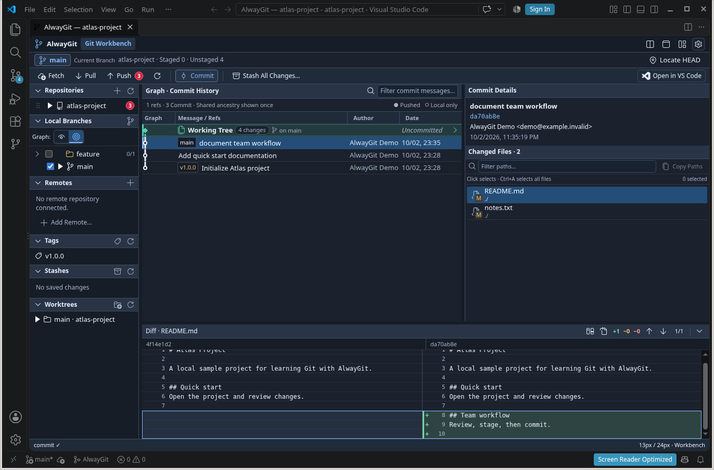

## Installation and the Workbench

AlwayGit brings Git repository navigation, commit history, file status, and read-only diffs into the VS Code editor area. When you first use it, complete the “edit → Stage → check Staged → Commit” cycle in a practice repository before attempting remote synchronization or history rewriting.

The screenshots mostly show the English interface. Exact button names are retained so you can find each action. You can choose English or Simplified Chinese; Git action names such as Stage, Commit, and Fetch remain in English.

### Requirements

Use VS Code 1.95 or later. Basic features require Git 2.40 or later; saving a Stash of selected files and performing isolated restores with Apply / Pop require Git 2.43 or later. Install AlwayGit from a VSIX package obtained from a source you trust. An existing project must already be a valid Git repository.

### Install the VSIX and launch AlwayGit

**Prerequisite:** You have obtained the installation package, VS Code can use Git, and you have confirmed that the project workspace is trustworthy.

1. Open the Extensions view in VS Code. From the view’s menu, choose Install from VSIX… and select the AlwayGit VSIX file.
2. After installation, check the extension details to confirm that the installed AlwayGit version matches the package. If VS Code prompts you to reload, do so.
3. Click the AlwayGit icon in the Activity Bar, then click Show Git Workbench. Alternatively, run AlwayGit: Show Workbench from the Command Palette.
4. On your first visit, use Add… under Repositories to add a repository, then double-click the target repository to open it.

**Result:** The AlwayGit workbench appears in the editor area. Once the repository has loaded, you can see its branches and history.

**Caution:** Opening the launch sidebar alone does not automatically create a workbench. Show first returns to an existing workbench in the current window, if one is available.

**Troubleshooting:** If Git is unavailable, check its installation and the Git path configured in VS Code. If the workspace is in Restricted Mode, change its trust settings only after confirming that the project is trustworthy.

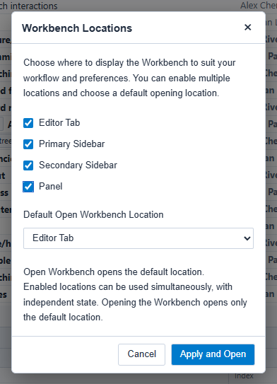

### Choose the display language

1. Click the gear in the upper-right corner to open Settings, then go to General → Language (常规 → 语言).
2. Select English or Simplified Chinese in the display-language list. The interface immediately previews your selection.
3. Click Apply (应用) to save. If you only want to try the language, click Cancel (取消) to revert the unsaved preview.

**Result:** The workbench uses your chosen language, and the applied selection remains when you reopen Settings.

**Caution:** File names, branch names, commit messages, and raw Git errors are not translated.

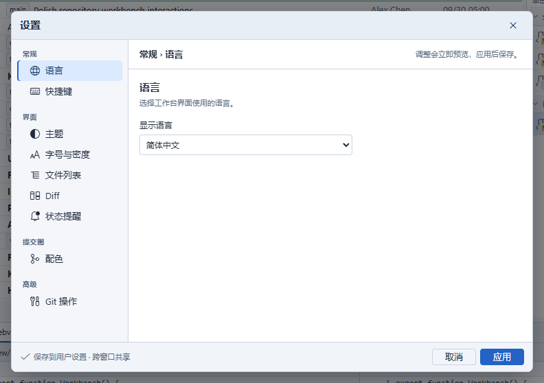

### Understand the four areas

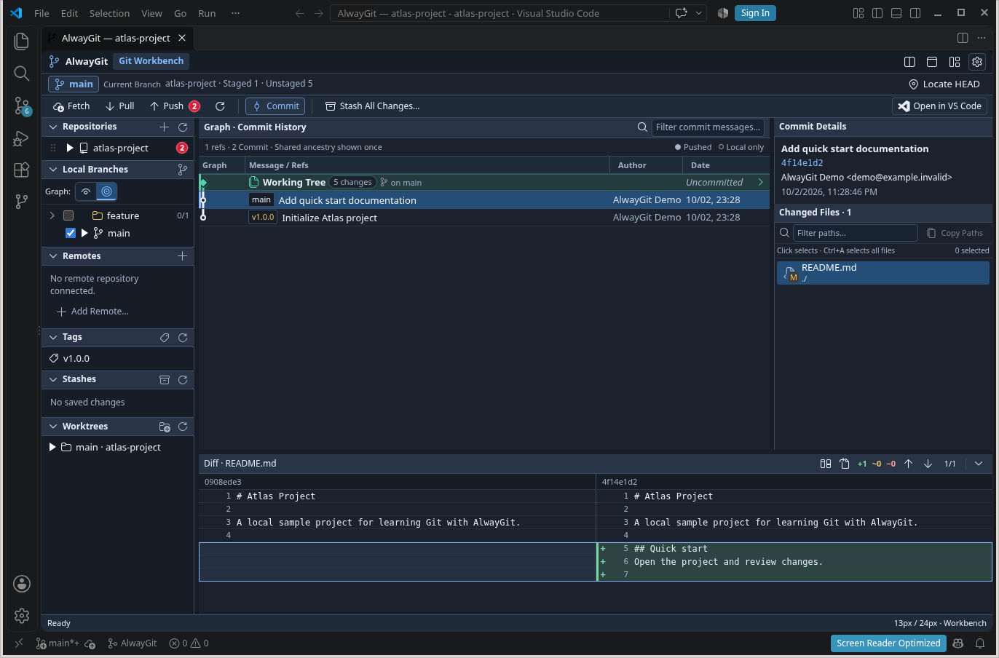

| Area | Purpose | What to check first |
| --- | --- | --- |
| Left navigation | Repositories, project groups, branches, remotes, Tag, Stash, and Worktree | The current repository and current branch |
| Center History | Commit graph, search, ref scope, and Working Tree | The commit or uncommitted changes you want to inspect |
| Right details | The commit’s file list or the Working Tree commit form | Changed files and the scope of Staged changes |
| Bottom Diff | Read-only comparisons and change-block navigation | The actual content added, modified, and deleted |

### How changes become a commit

Working Tree means the working files on disk; Index is the staging area for the next commit; a Commit is a version already saved in Git history. Stage places the selected files’ current changes into the Index. Commit saves only the Index; it does not automatically include other unstaged changes.

## Working Tree and Commits

Staged is the most important place to check before committing. A file appearing in both groups is not a contradiction: the Index contains one version, while the file on disk has changed again since it was staged.

| Status or group | Meaning | Recommended action |
| --- | --- | --- |
| Conflicts | Git still has unresolved conflict entries | First read “Merging and Resolving Conflicts” |
| Unstaged | Content on disk has not yet been placed in the staging area for the next commit | Review the Diff and select the files to stage |
| Staged | Changes in the Index that are ready to commit | Check the Diff in this area before using Commit |
| M / A / D / R | Modified / Added / Deleted / Renamed | Check both the file name and the complete parent directory path |
| ? / ! | Untracked / Conflict | Decide whether to track the file or resolve the conflict first |

### Inspect a file’s actual Diff

**Prerequisite:** You have saved your changes in the editor.

1. Click Working Tree, then click the file in the appropriate group.
2. Check the file and comparison targets in the Diff title at the bottom. In particular, confirm whether you are viewing Staged or Unstaged changes.
3. Use the previous and next arrows to review each change block, noting the counts of additions, modifications, and deletions.
4. To edit the full contents of a text file, use Edit in VS Code. Save it, then return to the workbench and check again. Images and other binary files are view-only in the AlwayGit preview.

**Result:** You can explain each block of changes you intend to keep and confirm that the comparison sources are correct.

**Caution:** The bottom Diff pane is read-only. PNG, JPEG and WebP changes appear side by side with zoom, synchronized scrolling, fit, 100% and maximize controls. Other binary files, oversized images and invalid text encodings show an explanation. VS Code editing and native Diff are disabled for images and other binary files.

**Troubleshooting:** If the content has not updated, first confirm that you saved it in the editor, then use Refresh. If the problem persists, check the output and error details.

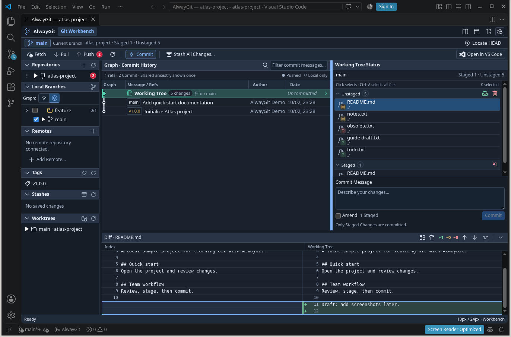

### Stage or Unstage specific files

**Prerequisite:** No unresolved conflicts remain, and you know which files should be included in the next commit.

1. Click the target file under Unstaged. Use Ctrl/Cmd or Shift to select multiple files.
2. Right-click an already selected file and choose Stage. Right-clicking an unselected file first changes the selection to that file alone.
3. Check the result under Staged. If you selected the wrong file, right-click it under Staged and choose Unstage.
4. If you truly intend to act on the entire group, use Stage All or Unstage All in the group heading and verify the count in the confirmation.

**Result:** Staged contains only the changes needed for this commit. After Unstage, the changes remain in the Working Tree.

**Caution:** This version operates on whole files. Search file names or relative paths below the Working Tree summary, ignoring case; use the clear icon to restore all files. Group actions apply to the entire group without a filter, or only matching paths with a filter. Tooltips and confirmations show the scope, independently of the current selection. Use a file’s context menu to act on selected items. Ctrl/Cmd+A selects only visible files. Filtering does not change the actual Index; Commit still includes all Staged content.

### Commit additions, deletions, and renames

**Prerequisite:** Use the VS Code Explorer to organize files, and back up important content.

1. Save newly created files, and confirm that files are no longer needed before deleting them. To rename a file, select it, press F2, and enter the new name.
2. Return to Working Tree and check for the question mark on new files, D on deleted files, or a rename status. If a rename initially appears as D at the old path and a question mark at the new path, first check the content of both.
3. Explicitly select the relevant paths and use Stage, then check them under Staged. Git may recognize the paired deletion and addition as R.
4. After committing, open the new commit directly in History to confirm the final paths and content.

**Result:** The additions, deletions, or renames are included in the intended commit, and you have checked how the content relates to the original files.

**Caution:** Rename detection depends on content similarity. Do not assume that a file has been lost solely because you see D and a question mark before committing.

### Commit while keeping unfinished changes

**Prerequisite:** At least one file is Staged, and you have prepared a commit message.

1. Check each Staged file, including deletions and renames.
2. Select Commit… to the right of Unstage in the Staged heading and enter a Commit Message in the dialog. Confirm the repository, branch, and complete Staged scope, then select Commit or press Ctrl/Cmd+Enter. Enter inserts a new line.
3. Click the new commit in History to verify the actual file list. Then return to Working Tree and check the remaining uncommitted changes.
4. If Unstaged changes remain, continue editing or staging them for a separate commit.

**Result:** History contains one new commit, and only the content in the Index is included in it.

**Caution:** Drafts save automatically per repository. Cancel, Close, Escape and the backdrop preserve the complete message for the next opening, including after reopening the workbench. Failures also keep drafts; a successful Commit clears the draft used by that action. You can open the dialog to write a draft before staging; the submission button reflects the prerequisites. View Commit in the success banner opens the new commit returned by this operation. Check its actual file content.

**Troubleshooting:** If the commit fails, expand the Git error. Keep the draft, address the cause first, then recheck the scope of Staged changes.

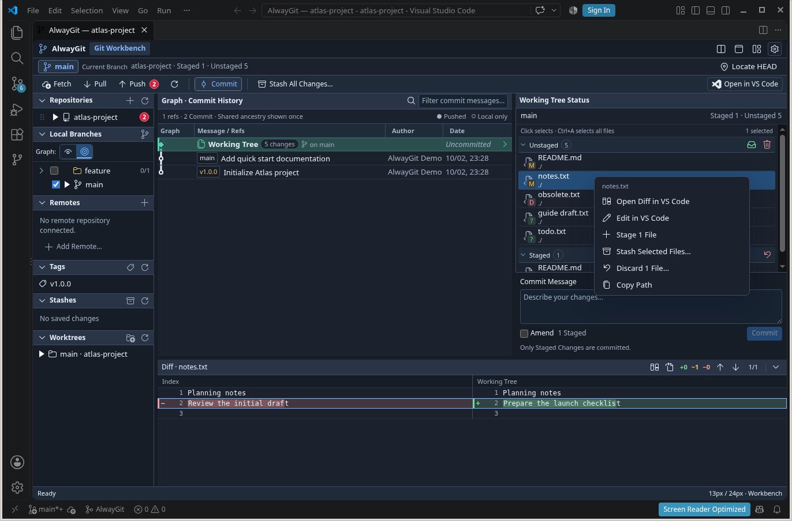

### Amend the last commit

**Caution:** Amend changes the commit ID. If the original commit has been pushed or used by others, coordinate with your collaborators first. Use View Commit in the completion banner or History to verify the new entry. Amend is unavailable while a Git operation is in progress.

**Prerequisite:** You have confirmed that the current HEAD is the commit you want to replace. Ideally, it has not yet been shared with others.

1. If you only need to change the commit message, you can leave Staged at 0. To add file content, first edit, save, and Stage the relevant files.
2. Open the Commit dialog and select Amend. An empty draft loads the current commit message; existing text is preserved. Verify the HEAD that will be replaced, then edit the message. Amend defaults off each time you reopen the dialog.
3. Check the staged content and message, then click Amend Commit when you are sure. This local operation can run immediately, so complete all checks before clicking.
4. Check history to verify the replacement and the new commit ID.

**Result:** A new commit replaces the current commit rather than simply being added after it.

**Troubleshooting:** To undo the effect of a commit that has already been shared, Revert is generally the preferred choice. If you are unsure, create a backup branch first.

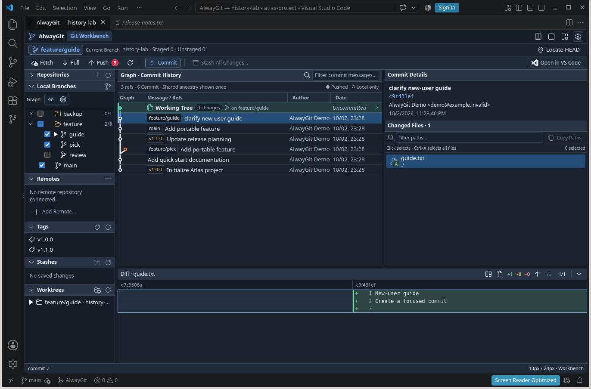

### Discard unwanted Unstaged changes

**Caution:** Discard removes the selected unstaged content. Selected untracked files are deleted from disk. Uncommitted content may have no recoverable Git history, so recovery cannot be guaranteed.

**Prerequisite:** You have confirmed that you do not need the selected changes. Any content you need has been committed, saved in a Stash, or backed up elsewhere.

1. Select the target files under Unstaged, right-click, and choose Discard….
2. Read the path list and discard explanation in the confirmation popover, checking each item. If a native VS Code Proceed confirmation follows, check again before continuing.
3. Use Discard All… in the heading only when you intend to discard all Unstaged changes. Alternatively, right-click the graph's Working Tree node and choose Discard All Unstaged Changes… without opening the file list. Node actions ignore right-side path filters and selection.
4. After the operation, check the remaining Unstaged and Staged changes to confirm the scope of its effect.

**Result:** The confirmed unstaged changes have been discarded. Content from the same file that was already in the Index should remain intact.

To discard both staged and unstaged content, right-click Working Tree and choose Discard All Changes…. The confirmation explains that the Index is also cleared, tracked content returns to the current commit, and added and untracked files are deleted. The branch and committed history do not move; before the first commit, staged additions are removed and the Index becomes empty. Other ignored files remain. Finish or abort active Git operations and resolve conflicts first. The node also offers Stage All, Unstage All, and Stash All Changes….

Large lists render only rows near the viewport, while filtering and Select All still cover the complete matching range. Discard has no 10,000-file cap; internal batches show progress. If the confirmed scope changes or an operation partly fails, use Recheck Remaining Changes and review the new list before confirming again.

**Troubleshooting:** If you discard something by mistake, stop further writes immediately and check the editor’s local history, backups, or existing Stashes. Do not proceed with Reset or cleanup operations.

## History and Diff Comparisons

Ref checkboxes control which history you see; branch names and row selections control which items you act on. Checking a branch does not switch to that branch.

### Filter history and locate the current version

**Prerequisite:** The repository has at least one commit.

1. In the left pane, check the local branches, remote branches, or Tags you want to view. Selecting multiple refs displays the union of the commits reachable from them.
2. Use Add to Graph Scope to add a ref to the existing scope. Use Show Only This Branch History or Show Only This Tag History to view only the target history.
3. Use the presets below Local Branches to quickly show all local branches or only the current branch.
4. Read the persistent History location area: actual checkout and HEAD, displayed history scope, and the object being viewed. A pending scope is shown separately; failed reads preserve the displayed graph and offer retry.
5. Use the back arrow to restore the previous history view. Use the home icon to clear searches and tag scopes and locate HEAD on the current branch. Locate HEAD preserves the existing scope. Navigation records last for this workbench session; very deep or outdated history is reread from the first page.

**Result:** History displays a commit graph that matches your selected ref scope.

**Caution:** Working Tree is a virtual node, not a historical Commit. After HEAD is filtered out, it may still appear on its own and is not counted as an actual history entry.

### Search commit messages and return to full history

**Prerequisite:** You know a keyword from the commit message.

1. Enter the keyword in the commit search field in History.
2. Review the commit search results and the match count. A plus sign after the count indicates that additional matches have not yet loaded.
3. Click a matching commit to inspect its details on the right.
4. Use the icon for locating the commit in full history to clear the search and locate that commit within the current ref scope. You can also clear the search manually.

**Result:** Search filters commits by message. Returning to full history restores the Graph and column widths.

**Caution:** Search results hide the Graph because intervening commits that do not match may be missing. Do not interpret the absence of connecting lines as damaged history.

**Troubleshooting:** If you cannot find the target, check the keyword and ref filter scope. Do not assume that the search covers all unselected branches.

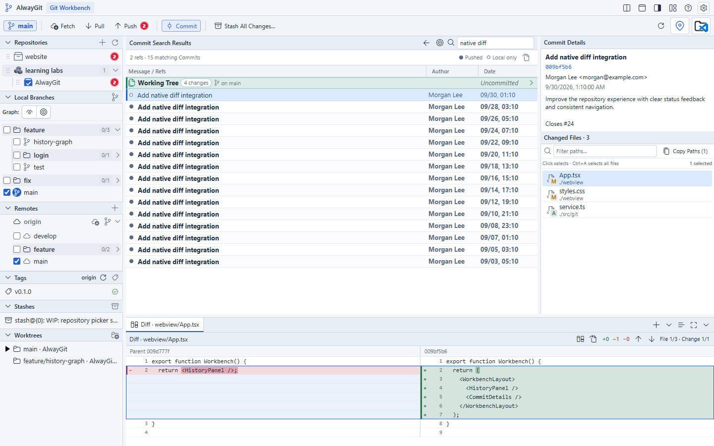

### Inspect commit content and merge parents

**Prerequisite:** The target commit is in the loaded history.

1. Click a Commit row to read its message, author, timestamp, and changed files.
2. Use the file-path filter field to narrow Changed Files. Matching is case-insensitive and uses the full repository-relative path.
3. Click a file to view its Diff. For a Merge Commit, use the Parent selector to choose the parent commit to compare against.
4. For text files, use native Open Diff to view the full content or Edit in VS Code to change the current Working Tree file. Use the bottom preview only for images and other binary files.

**Result:** The Diff corresponds to the currently selected Commit, Parent, and file.

**Caution:** Different Parents produce different diffs. The edit action in historical details operates on the file in the current Working Tree; it does not directly modify the old commit.

### Compare two commits

**Prerequisite:** You know which two versions you want to compare, and both are loaded.

1. Click the first Commit, then Ctrl/Cmd-click the second so that exactly two commits are selected.
2. The right pane automatically switches to Compare Commits. Check the commits on the left and right. If one is an ancestor of the other, the ancestor appears on the left; otherwise, selection order is used.
3. Click a changed file to view its Diff. Click the swap button when you want to reverse how additions and deletions are shown.
4. Deselect commits until only one remains to return to single-commit details.

**Result:** The changed-file list and bottom Diff pane show the changes between the two versions.

**Caution:** Selecting three or more commits returns to the details of the last commit you interacted with, while retaining the multiple selection for batch actions. It does not compare several versions at once.

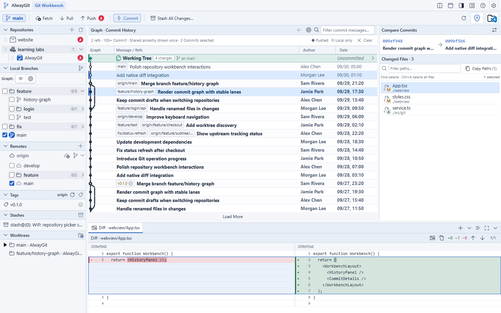

### Read and navigate diffs

**Prerequisite:** The target file is open in the bottom Diff pane.

1. Note the current file's added, modified, and deleted block counts. Historical Commits default to “File 2/5 · Change 1/3”, showing the file position and the block position within that file.
2. Previous and Next follow the current Commit's changed-file order by default. Next enters the first block of the next file; Previous enters the last block of the previous file. The Commit's first and last blocks wrap around. Merge Commits keep the selected Parent, and navigation stays in the same Commit.
3. To browse one file, open Settings → Interface → Diff, change “Diff navigation scope” to “Current file”, and Apply. This mode shows current / total blocks; with only one block, either button locates it again. The preference is saved for this workspace.
4. Scroll horizontally for long lines or drag the divider for a larger reading area. Collapse and reopen Diff to continue reading; check the comparison title after switching files.

**Result:** Choose to inspect the entire Commit or the current file block by block. Adjacent changed lines form one contiguous block.

**Caution:** Entire Commit includes files hidden by the path filter. The Diff title shows the actual path, and the file list identifies a hidden current file. Binary files and files without text change blocks are skipped but remain available for manual inspection. Read failures stop navigation and show an error. Truncated previews only count and navigate previewed changes; open the native Diff or editor for the full content. Working Tree, Stash, and Commit comparisons still cycle within the current file.

## Branches and Historical Versions

A branch is a movable reference to a version. Creating a branch, switching branches, and filtering branch history are three separate actions. Read the button label before acting and the completion feedback afterward.

### Create a branch, with or without switching to it

**Prerequisite:** Confirm the starting point and safely save any changes in your working directory.

1. Click Create Branch… in the Local Branches header. You can also right-click a specific branch, Tag, or Commit to create a branch from that fixed starting point.
2. Check the starting point shown in the dialog and enter a new branch name, such as feature/readme.
3. Resolve any name warnings. Duplicate names, invalid names, and parent/child path conflicts require a different name before you can proceed.
4. Choose Create Only to create just the reference, or Create and Checkout to start working on the new branch.
5. Read the completion feedback and check the current-branch indicator to confirm whether you actually switched branches.

**Result:** The new branch has been created, and whether you switched to it matches the action you selected.

**Caution:** For example, if feature/readme already exists, you cannot create feature. Likewise, if feature already exists, you cannot create feature/readme.

**Troubleshooting:** If creation succeeds but changes block Checkout, the new branch may already exist. Check the feedback first rather than blindly trying to create another branch with the same name.

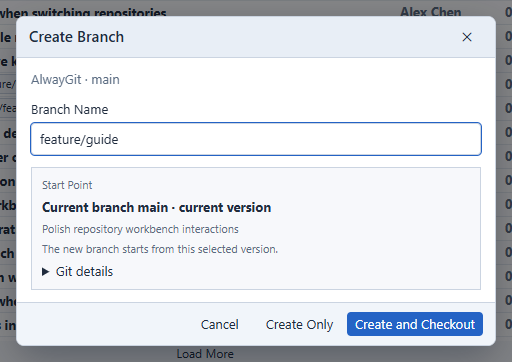

### Switch to a local branch and handle a blocked checkout

**Prerequisite:** The target is not the current branch and is not in use by another Worktree.

1. Double-click the target local branch, or right-click it and choose Checkout….
   During execution, the workbench shows its own centered progress dialog. Background actions and shortcuts stay locked until the result is synchronized.
2. If a warning says that changes could be overwritten, review the affected files rather than discarding them immediately.
3. Depending on your goal, Commit first, Stash first, or use Stash Changes & Checkout if that option is explicitly offered.
4. After switching, check the current-branch triangle and the file status in Working Tree.

**Result:** The current branch has changed, the working directory matches the target version, and any changes you need to keep are still safely stored.

**Caution:** A branch in use by another Worktree cannot be checked out directly in the current directory. You can open the Worktree identified in the message instead.

**Troubleshooting:** If there are conflicts or an operation is in progress, complete it or use Abort first. A single click on a branch name only navigates to it; it does not mean that Checkout has run.

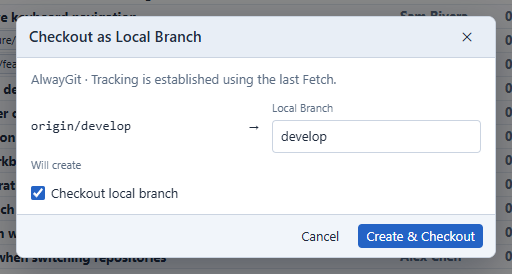

### Create a local tracking branch from a remote branch

**Prerequisite:** You have run Fetch, and the remote reference is at the latest state you want to use.

1. Double-click the remote branch, or right-click it and choose Checkout as Local Branch….
2. Check the remote source and local branch name. By default, the remote prefix is removed and the directory structure is preserved.
3. If the correct tracking branch already exists, choose to reuse it. If a branch with the same name has a conflicting upstream, or there is a path conflict, change the name first.
4. Leave the Checkout option selected or clear it as needed, then confirm creation or reuse.
5. To prepare multiple tracking branches at once, use Create Local Tracking Branches… on the same Remote or directory and check the result for each branch.

**Result:** The local branch tracks the correct remote source. Batch creation leaves the current branch unchanged.

**Caution:** This action does not automatically run Fetch or Pull. Symbolic references such as origin/HEAD are not targets that can be turned into ordinary local branches.

### Delete a local branch you no longer need

**Prerequisite:** Confirm that the branch is no longer needed and that any important commits are retained by another branch or backup reference.

1. Right-click a local branch other than the current branch and choose Delete Branch….
2. Check the branch name and warning. If you are unsure whether it contains unique commits, cancel and inspect the history first.
3. After confirming, check the branch list and the current branch.

**Result:** The target local branch reference has been removed, and the current branch remains clearly identified.

**Caution:** Restrictions apply to the current branch and branches in use by other Worktrees. Deleting a remote branch is a separate action that affects collaborators.

### Inspect an older version safely

**Prerequisite:** Your target is an older Commit or Tag, and you do not intend to work directly without a branch.

1. Double-click the older Commit, or choose Create Branch and Checkout… from its Commit or Tag context menu.
2. If a local branch already points directly to the target, select that branch when prompted. Otherwise, enter a new branch name.
3. Check the fixed starting point, create and switch to the branch, then inspect the files.

**Result:** You are inspecting the older version on a named branch, so subsequent commits have a clearly identified branch to belong to.

**Caution:** Direct Detached HEAD Checkout is disabled by default. The Commit and Tag context menus show this action disabled with an explanation to create a branch. At a local branch tip, the Commit menu names that branch or asks you to select one. If you deliberately enable the advanced option, you must still create a branch to retain any new commits made afterward. The original branch reference does not automatically move with them.

**Troubleshooting:** If you discover that you are already in Detached HEAD, create a branch for any new commits you need to keep before switching back to the original branch.

## Remote Collaboration

Fetch updates your local knowledge of the remote state. Pull integrates remote changes into the current branch. Push sends local commits to the target remote. Distinguish these three actions first, then check the source and destination.

### Add a remote

**Prerequisite:** Obtain the correct remote repository URL or local Git remote path, and prepare the authentication method required by any online service.

1. Click the Add Remote… plus button in the Remotes header, or use the right-click entry with the same name.
2. Enter a name, such as origin, in Remote Name and your own remote address in Repository URL. The example placeholder address is not an actual repository. Confirm that the target belongs to the intended project, then click Add Remote.
3. After adding it, check Remotes and run Fetch to retrieve references if necessary.

**Result:** The remote appears in the navigation and remote branches can be fetched.

**Caution:** Do not put access tokens or passwords in descriptions, commit messages, screenshots, or untrusted URLs.

**Troubleshooting:** If authentication fails, use the authentication flows supported by the hosting service and VS Code. Do not repeatedly change repository contents as a way of troubleshooting.

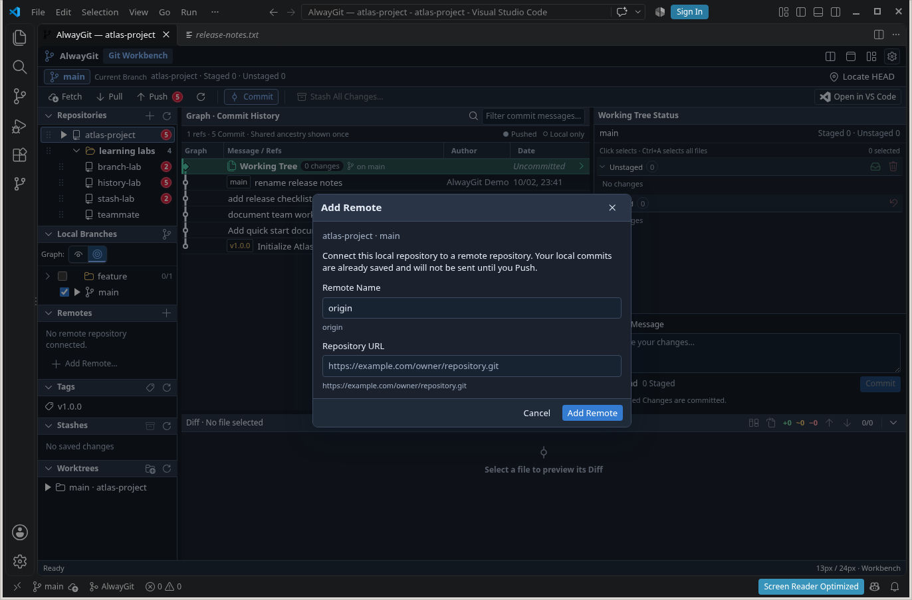

### Fetch remote updates and pull changes

**Prerequisite:** A remote is connected. Before running Pull, confirm the current branch and the state of local changes.

1. Run Fetch for the target Remote and wait for the results bar to report success.
2. Inspect the remote branches and history differences to understand the commits you are about to integrate.
3. Use Pull when you need to update the current branch. Check the source in the optional Remote field and the current upstream information. In Pull Strategy, select a strategy that follows your collaboration conventions. Use Fast-forward Only when only fast-forward updates are allowed.
4. After success, inspect the history. If conflicts occur, complete or abort the operation as described in “Merging and Resolving Conflicts.”

**Result:** After Fetch, remote references have been updated. After Pull, the current branch has integrated the target changes or has clearly entered a state requiring further action.

**Caution:** The Graph status indicating that a commit is already on the remote is based on the remote references known locally after the most recent Fetch. It is not a live query of the server.

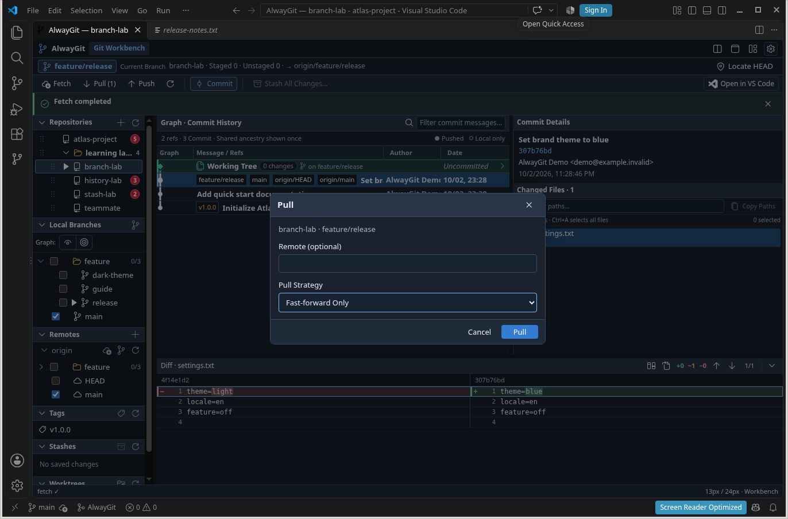

### Push local commits

**Prerequisite:** You are on a clearly identified local branch, and the commits to send have been reviewed.

1. Click Push and read the actual Local Branch → Remote/Remote Branch mapping.
2. If no remote exists, follow the instructions to Add Remote… and finish connecting it, then return to Push.
3. On the first Push, note the information about setting up upstream tracking. If there are multiple remotes and the target cannot be determined, explicitly select the remote.
4. To change the destination, use Change Target… and check the source, remote, and target branch again.
5. Run Push, wait for success feedback, and check that the unpushed count has updated to reflect the actual state.
6. The result card shows publication or update status for each destination. Use the open/copy icons for remote links, and expand Operation details for output. Check each destination before retrying a partial Push.
7. On GitHub/GitLab, use the result or branch context menu to start a PR/MR. Without a server-provided link, confirm the target repository and branch in the AlwayGit frontend dialog, then finish on the website. GitHub supports selecting the upstream repository for a fork; GitLab forks require a server-provided MR link. The shortcut does not submit a request or query existing PR/CI status. Pushed GitHub tags also offer a release creation shortcut.

**Result:** The target remote branch has received the intended commits, or a clear reason for failure is shown.

**Caution:** The Push badge shows the number of unpushed commits, not the number of errors. The toolbar Push action is unavailable in Detached HEAD. A normal Push sends only the branch by default and explicitly uses `--no-follow-tags`, so it does not inherit the machine's `push.followTags` configuration. To include annotated Tags that point into the pushed history, enable “Push related annotated Tags” under Advanced options. You can use that choice once or select “Remember as default” to persist it in Settings. Lightweight Tags and unrelated Tags still require the explicit Tag Push action.

**Troubleshooting:** If the push is rejected, run Fetch first and check for diverging histories, authentication issues, and permission problems. Do not treat Force-with-lease as a routine retry.

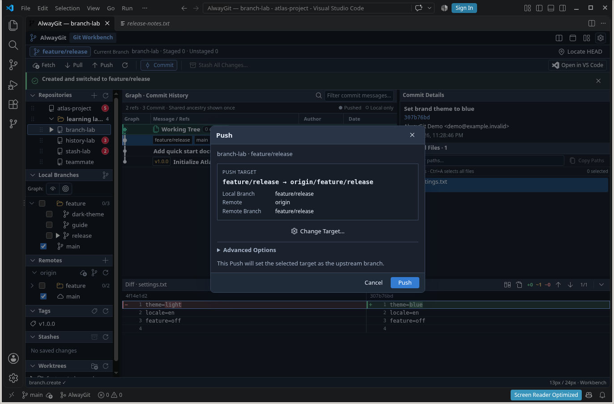

### Use Force-with-lease cautiously

Force-with-lease is in the advanced Push options and is intended for situations where you have already decided to rewrite remote history. It provides protection only when the remote has not undergone changes unknown to you; it does not mean that others will be unaffected. Before using it, confirm with your collaborators, keep backup references, and understand the history you will replace. If you are unsure, cancel, then Fetch and compare first.

### Delete remote branches

`Delete Branch from <remote>…` for a remote branch changes a reference on the server. Whether deleting one branch or multiple branches selected under the same Remote, check the remote and branch list item by item and read the second confirmation. If only some deletions fail, handle each result individually. Symbolic references such as origin/HEAD cannot be deleted as ordinary branches.

## Temporarily Saving and Restoring Changes

Stash temporarily saves changes that have not yet been committed. It is entirely different from Stage: Stage prepares changes for a commit, while Stash saves them and clears them from the working directory. When restoring, use Apply first to keep the original entry, then decide whether to delete it after checking the result.

### Save all changes

**Prerequisite:** You want to set aside your current work temporarily and know whether you need to include untracked files.

1. Use Stash All Changes… in the top toolbar or the Stashes header.
2. Enter a description that will help you identify the entry, and select the option to include untracked files if needed.
3. Confirm the scope to save, then run the action. Read the number of files saved, the number of untracked files, and the post-operation status.
4. Find the new entry under Stashes and inspect its contents.

**Result:** The selected scope has been saved as a Stash, and the working-directory state matches the feedback.

**Caution:** Include untracked files does not include files ignored by .gitignore. When it is not selected, ordinary untracked files are not saved either. Stash is not a substitute for a full project backup.

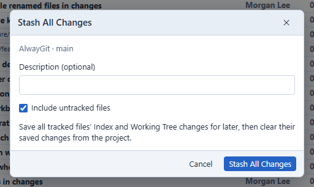

### Save only selected files

**Prerequisite:** Use Git 2.43 or later. You want to temporarily save and set aside certain whole files while leaving other files unchanged.

1. Select the target files in Working Tree. You can select files across Staged and Unstaged.
2. Right-click the selected files and choose Stash Selected Files….
3. Check the deduplicated file count, full paths, and description, then confirm to save.
4. Verify that unselected files remain unchanged and inspect the file categories in the new Stash.

**Result:** The explicitly selected files have been saved in full, with each file counted only once. Unselected files should not have been cleared along with them.

**Caution:** Even if you select a file from the Staged side, the file's complete Index and Working Tree state is saved, not just the side you are viewing.

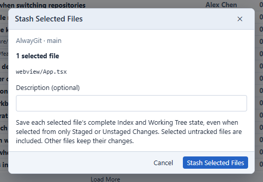

### Inspect and restore a Stash

**Prerequisite:** Use Git 2.43 or later and confirm that the current repository and branch are correct. Check and safely save any other work first. A clean working state is recommended for restoration.

1. Right-click the Stash and choose View Changes. Use the tabs that actually appear to inspect the Working Tree, Index, and Untracked Files categories and counts.
2. Prefer Apply Stash to retain the original entry after restoration. Choose Pop Stash only if you specifically want the entry deleted after a successful restoration.
3. In the confirmation dialog, check the Stash description and target repository, then click Apply Stash or Pop Stash.
4. If preflight passes, wait for the restoration result and check how the changes are distributed between Staged and Unstaged.
5. Confirm that the file contents are correct, then decide whether to delete the Stash if it is no longer needed.

**Result:** The saved file state has been restored to the current working directory. Apply retains the entry; Pop deletes it only after success.

**Caution:** Restoration attempts to preserve the original Index state. Do not treat Stash as a remote backup; entries belong to the local repository.

**Troubleshooting:** If a message explains that restoration is blocked, resolve the occupied paths or conflicts first, then close the dialog and try again to trigger a new preflight.

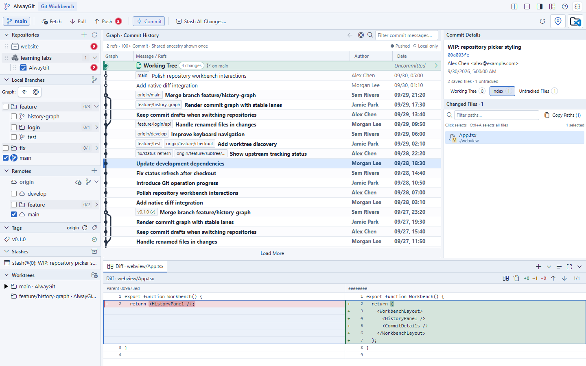

### Handle a blocked Stash restoration

**Prerequisite:** Apply or Pop reports that it cannot restore safely.

1. Read the reason for the block and Git details. Show Log contains the same underlying diagnosis. “Conflicting files” identifies confirmed conflicts; “Files involved in restoration” describes the saved content and does not identify which files blocked restoration.
2. Use the comparison entry point to compare the contents saved in the Stash with the current files. Open the current files if necessary.
3. Check other currently Staged and Unstaged files. If necessary, Commit them, save another Stash, or make a reliable backup to provide a clean working state for restoration. Do not discard existing contents just to retry.
4. After resolving the block, close the dialog, select the Stash again, and run the restoration.

**Result:** The prerequisites for restoration have been clarified, or you have safely stopped the restoration and retained the original Stash.

**Caution:** A preflight block stops the entire restoration. If new external changes or write errors occur after actual execution begins, do not assume that the working state is necessarily completely unchanged. Always inspect the actual result.

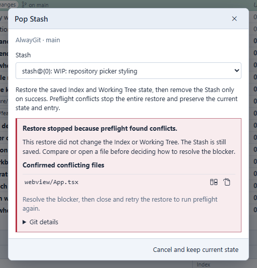

This is the older blocked-restoration dialog. The current version distinguishes confirmed conflicting files from files involved in restoration, and Git details provides the specific diagnosis.

### Delete a Stash you no longer need

**Caution:** Drop has no standard undo, so confirm first that you no longer need to retain the saved contents. Do not identify an entry solely by its stash number before deleting it; other save or delete actions may change the numbering.

**Prerequisite:** Confirm that the contents do not need to be restored, or that they have already been fully restored and checked.

1. Right-click the target Stash and choose Drop Stash….
2. Check the entry's description and identity, then confirm deletion.

**Result:** The target entry has been removed from the Stashes list.

### Support limits for isolated Stash restoration

Saving a selected-files Stash and isolated Apply / Pop restoration require Git 2.43+. Sparse checkout, affected submodules, active external filters, custom or default external merge drivers, unsupported file types, and other conditions may prevent the working state from being reproduced accurately and block the operation. A single file exceeding 32 MiB or local snapshots exceeding 128 MiB in total will also stop the operation. Working-state checks may be affected by files that were not selected.

These are the limits of AlwayGit's isolated trial, not the full capabilities of Git Stash. If you encounter a limit, preserve your existing changes and Stash first, then follow the specific guidance. Do not discard contents simply to bypass the protection.

## Merging and Resolving Conflicts

The goal of conflict resolution is to produce the correct final file contents. Marking a file as resolved and staging it only tells Git that the file has been handled; it does not determine whether the result is logically correct.

### Merge another branch into the current branch

**Prerequisite:** Switch to the target branch that will receive the changes. Save any current changes and create a backup branch if necessary.

1. Confirm that the current branch is the one that will receive the merge.
2. Right-click the local or remote branch providing the changes and choose Merge….
3. In the dialog, check the source and the current target branch again, then confirm the merge.
4. If it succeeds, inspect the history. If conflicts occur, follow the conflict-resolution workflow below rather than starting Merge again.

**Result:** The merge has succeeded or has clearly entered an in-progress state. The results bar explains the actual outcome.

**Caution:** The branch you right-click is the merge source. The current branch is the target that will be updated.

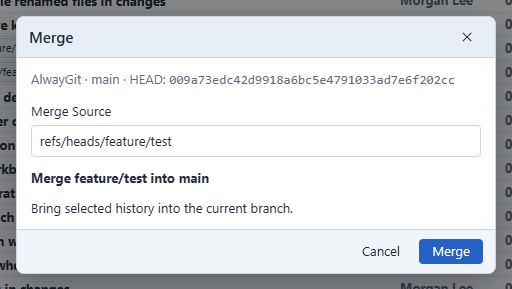

### Resolve conflicts manually

**Prerequisite:** The workbench shows an in-progress Git operation, or there are files under Conflicts.

1. Click the control for viewing conflicts in the operation bar to go to Working Tree and locate the conflicted files.
2. Ours / Theirs at the bottom is a read-only comparison. Click the pencil beside a conflicted file to open it in VS Code, understand the changes on both sides, and edit the file into the complete result you want to keep.
3. Remove any conflict markers that should not remain and save the file. Check related files and run the project's own validation if necessary.
4. Return to AlwayGit, select the conflicted files you have finished handling, and use Manually handled: Mark & Stage. When no individual file is selected, the All button handles all conflicted files.
5. Check Staged Diff to confirm that the staged content is the result you just saved. Repeat for the other conflicted files.

**Result:** Git has no remaining unmerged entries and the operation bar indicates that the result is ready for review. You must still manually confirm that the contents are correct.

**Caution:** Do not confuse ordinary Stage with marking a conflict as handled and staging it. After saving the contents in the editor, you must stage them again to update the Index.

**Troubleshooting:** If you chose the wrong contents, continue editing, save, then stage again and review. Do not treat a conflict count of zero as proof that validation passed. If the native editing flow prompts you to Trust the project workspace, follow Chapter 11 to handle the trust status of the target window.

### Review the staged result and continue

**Prerequisite:** All conflicts have been handled as intended and the Staged result has been reviewed.

1. Click Continue or use the ordinary Commit action while the operation is active.
2. Read the staged-content review list, checking the locations of suspected conflict markers and any files that were not scanned.
3. If you find a problem, return to review. Inspect it in the staged Diff and use the editing entry point to correct the file. Save your changes and Stage them again.
4. If the review finds no problems, click Confirm & Continue.
5. If there are suspected markers or unscanned files, select the required acknowledgment and use the option to continue anyway only after explicitly checking them. Otherwise, choose Return to Review.
6. When the operation finishes, confirm that the active operation bar has disappeared, then check the history and Working Tree.

**Result:** The in-progress operation has actually finished, and you have reviewed the resulting contents.

**Caution:** The review has limits involving size, binary files, encoding, and submodules. An absence of suspected markers does not guarantee semantic correctness. Changes to the Index or branch after the review require another review.

### Abort an in-progress operation

**Prerequisite:** Confirm that you no longer want to continue this Merge, Rebase, Cherry-pick, or Revert.

1. Choose Abort or the option to abort the current operation in the persistent operation bar or the operation dialog.
2. Read the starting commit and the recovery information. If you need to keep your manual resolution work, make a reliable backup first.
3. Proceed through the workbench explanation and native confirmation, then check the current branch, history, and file status.

**Result:** Git has attempted to restore the state from before the operation began, and the in-progress indicator has disappeared.

**Caution:** Closing the operation window only closes the window; it does not abort the Git operation. Abort may discard changes made while resolving conflicts. Changes that existed before the operation may affect whether full restoration is possible.

**Troubleshooting:** If Abort fails, stop repeating write operations, retain the error information, and inspect the actual Git state before taking further action.

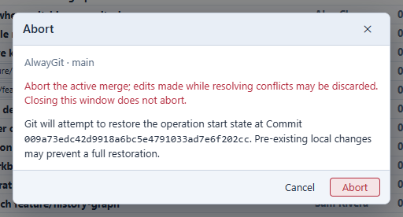

## Organizing Commit History

Use the operations in this chapter only after you understand the relationships in the history. Before proceeding, record the current branch and commit, create a backup branch, and resolve or save any uncommitted changes. For history that has already been shared, prefer corrections made through new commits that can be reviewed.

### Create, push, and delete Tags

**Prerequisite:** Identify the version you want to tag.

1. Right-click the target Commit or branch and choose Create Tag…, or use the entry point in the Tags heading.
2. Enter a name, such as v1.1.0, in Tag Name and verify Target Commit. Fill in Annotation if needed. To publish immediately, enable “Push this Tag after creation” and select a Remote; use it once or remember it as the default.
3. Check the new tag under Tags and use Locate Tag Commit in Graph to locate it. Add to Graph Scope only adds its history to the display scope.
4. To publish tags, right-click one or more Tags, choose Push Tag… or Push N Tags…, then verify the complete Tag list and Remote.
5. To delete a local tag, right-click the target Tag, choose Delete Tag…, verify the name, and confirm.

**Result:** The local Tag points to the specified version, the explicitly selected Tags are published to the Remote, or the target local Tag has been removed.

**Caution:** Create-and-push keeps the local Tag first; if the remote push fails, retry later with Push Tag. Tag Push sends only the Tags listed in the dialog, supports lightweight and annotated Tags, does not include other local Tags, and does not overwrite a differently identified remote Tag with the same name. Local deletion does not delete a remote Tag; this version does not provide remote Tag deletion or replacement.

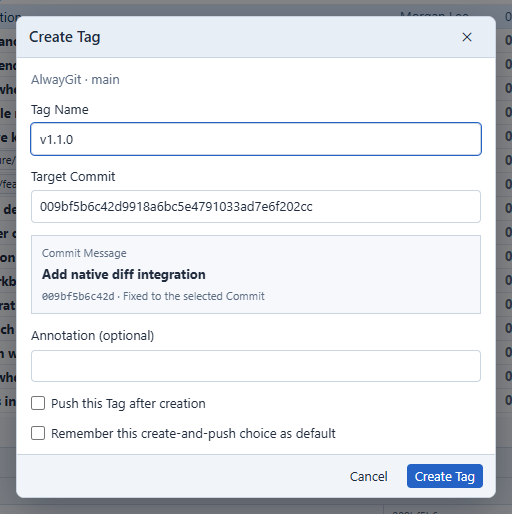

### Apply a specific commit to the current branch

**Prerequisite:** The current branch is the receiving branch, the working directory is ready, and you understand the target commit's contents and dependencies.

1. Switch to the branch that should receive the changes.
2. In History, right-click the ordinary Commit you want to apply and choose `Cherry-pick to <current branch>`, for example, Cherry-pick to main.
3. For a Merge Commit, perform the operation separately and choose Mainline Parent. First understand which parent the changes will be taken relative to.
4. For a batch operation, explicitly select the actual Commits you need, then run the batch Cherry-pick. Commits are applied from oldest to newest in topological order.
5. After success, check the new commits. If a conflict occurs, resolve it and Continue, or Abort.

**Result:** The target changes have been added to the current branch as new commits, or the operation is explicitly paused and awaiting resolution.

**Caution:** Ordinary Cherry-pick is disabled for the current HEAD and commits already in the current branch history, with an explanation. A batch containing any such commit is disabled as a whole; deselect those commits first. Other ordinary Commits can execute immediately after ancestry checks pass, so verify the target before clicking. Batch Cherry-pick is not supported for a selection that includes a Merge Commit. If changes from a historical commit were reverted or removed, use `Reapply Historical Commits…` and explicitly check the confirmation before submitting. This entry is unavailable for the current HEAD, and reapplication can still produce conflicts or an empty result.

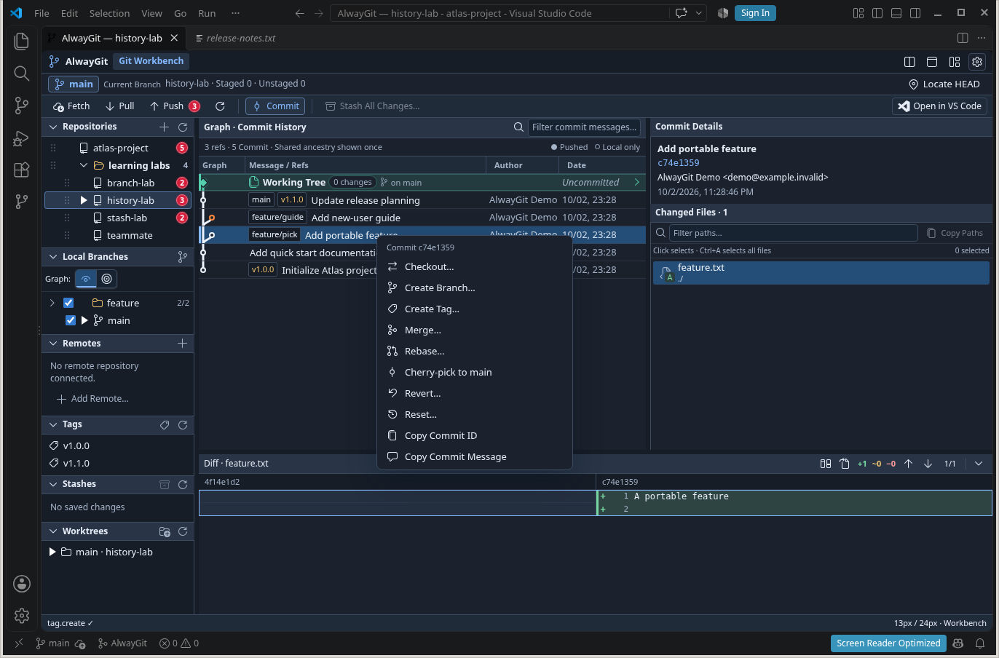

### Use Revert to undo an ordinary commit

**Prerequisite:** The target is an ordinary Commit, and you want to preserve the existing history while undoing the target's effects in a new commit.

1. Switch to the branch you want to correct and check that the target Commit belongs to the relevant history.
2. Right-click the target Commit and choose Revert….
3. Verify the target and the confirmation message, then proceed. If a conflict occurs, resolve it manually and check the staged result.
4. When finished, review the new revert commit and the file contents.

**Result:** A new commit undoes the target's effects, while the original commit remains in the history.

**Caution:** Revert is not the same as restoring the entire repository directly to that commit, and it does not guarantee automatic compatibility with later changes. For a Merge Commit, you must specify Mainline Parent. If you do not understand the parent versions, cancel first to avoid undoing the wrong set of changes.

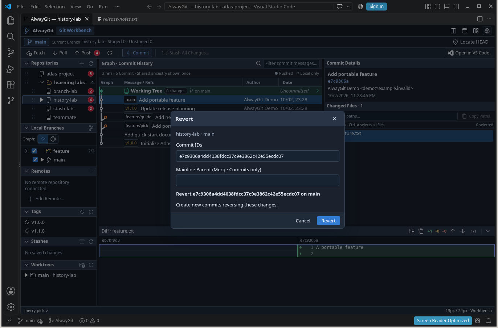

### Reset the current branch to a specific commit

**Caution:** Hard can discard uncommitted content. Resetting shared history affects collaboration; do not subsequently force-push to the remote without coordinating with others.

**Prerequisite:** You understand that this moves the current branch, have a backup reference, and have reliably saved any uncommitted content.

1. Confirm that the current branch is the branch you intend to reset.
2. Right-click the target Commit and choose Reset….
3. In the dialog, verify the target and mode: Soft preserves the Index and working files; Mixed resets the Index and preserves working files; Hard also resets working files. To reuse the current mode, enable “Remember this Reset mode as default”; you can also change it under Settings → Advanced → Git Operations.
4. Read all warnings and execute Reset only when the mode matches your intent exactly. If a native VS Code Proceed confirmation appears, verify the target again before continuing.
5. Check where the current branch points, along with Staged and Unstaged, to confirm the actual result.

**Result:** The current branch has moved to the target commit, and the Index and working directory have been handled according to the selected mode.

**Troubleshooting:** After an accidental operation, stop making further changes and try to recover from the backup branch first. Git reflog may help recover old commits, but it cannot guarantee recovery of uncommitted file contents.

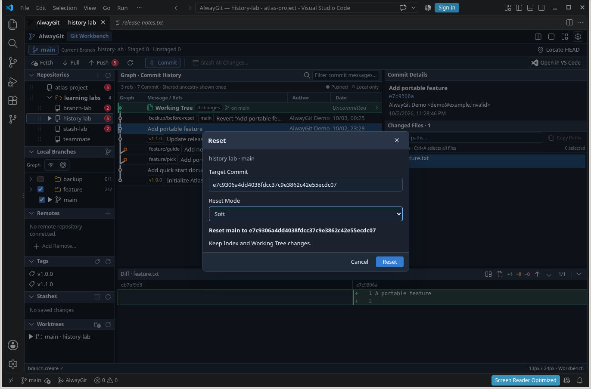

### Perform a standard Rebase

**Caution:** This version provides standard Rebase. It does not provide interactive reordering, Squash, or Fixup.

**Prerequisite:** The current branch is the branch whose commits will be replayed. Others do not yet depend on those commits, or you have already agreed on the operation with your collaborators.

1. Switch to the branch you want to reorganize and create a backup branch at its current position.
2. Right-click the new base branch and choose Rebase….
3. Verify the current branch and the new base, then confirm to begin.
4. If conflicts occur, resolve them step by step, stage the changes, and Continue. Consider Skip only when you explicitly intend to discard the commit currently being replayed.
5. When finished, verify the commit contents and history relationships. If the result is unexpected, choose a recovery method based on the actual state.

**Result:** The current branch's commits have been replayed onto the new base. Commit IDs may change.

**Troubleshooting:** You can Abort while the operation is in progress. To recover after completion, use the backup reference saved beforehand; avoid further history rewriting without first checking the state.

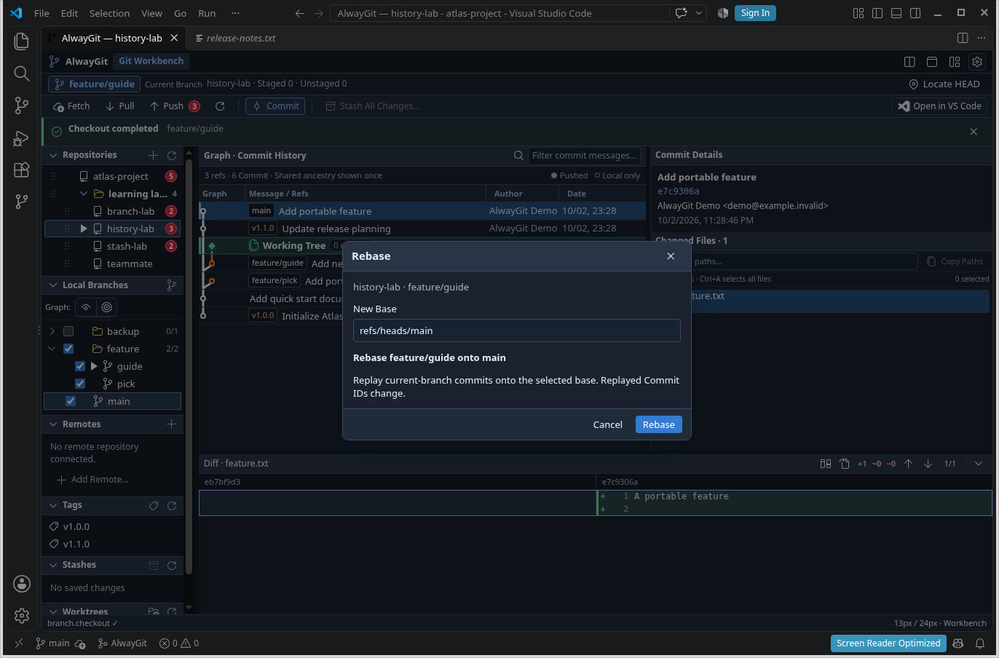

## Repositories and Project Groups

First select the item you intend to operate on, then identify the current working repository. A blue selected row identifies the target of an action. The highlighted repository icon marks the current repository; a solid triangle marks the current Worktree or local branch. The current item and action selection can differ. Repositories, Local Branches, one Remote, and Worktrees retain only one blue action-selection scope at a time. Moving to another object type clears the previous blue selection without changing the current repository, current branch, or Graph checkboxes.

### Add one repository or discover several

**Prerequisite:** The target directory is already a Git repository, or contains several Git repositories, and you have permission to read these directories.

1. Click the Add… plus button to the right of the Repositories heading and choose Add Repository.
2. Select a repository directory, or a parent directory containing multiple projects.
3. Wait for the scan to finish. Check the repository names and whether each can be added or has already been added. Filter, deselect items, or select a contiguous range as needed.
4. Select the target group, creating a new group within the same workflow if necessary. Check the number of repositories shown on the primary add button, then confirm.
5. Double-click a newly added repository in the navigation, or focus its row and press Enter.

**Result:** The selected repositories appear in the navigation. Existing repositories are not added again; only the repositories included in your final confirmation are registered.

**Caution:** Once the scan finds a valid repository, it does not continue scanning inside it, so it will not also discover nested repositories or submodules. Closing or canceling the scan does not add a partial selection.

**Troubleshooting:** Inaccessible directories are skipped. Review the reasons in the scan results, check the paths and permissions, then retry those directories individually.

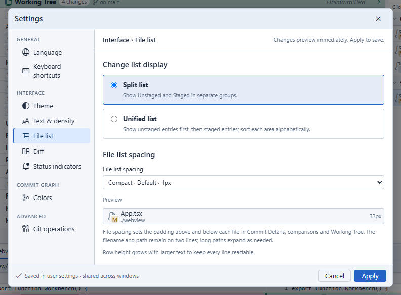

### Create and organize project groups

1. In the Add… popover, switch to Add Group, enter a name, and create the group.
2. Right-click one or more repositories, choose Move to Repository Group…, then select the target group.
3. Click a group heading to expand or collapse its contents. To change the order, drag items at the same level or use the move-up and move-down options in the context menu.
4. Right-click a group to rename or delete it. Read the confirmation message before deleting.

**Result:** Repositories are arranged by your project categories. When you delete a group, its repositories return to the root level.

**Caution:** Groups organize the navigation only. They do not move directories on disk or combine the contents of different repositories.

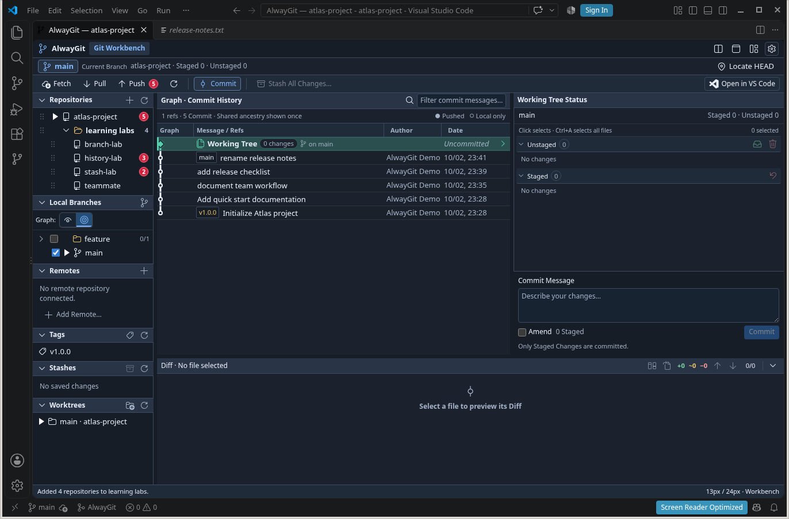

### Select items and switch repositories

**Prerequisite:** Confirm that the target repository has been added.

1. Clicking a repository name once only selects it as the target of an action. Hold Ctrl (Cmd on macOS) to add or remove individual selections, or Shift to select a contiguous range of visible items.
2. To actually switch the current repository, double-click the target repository, or select it and press Enter.
3. After switching, check the current repository icon, branch name, and Working Tree before performing any write operation.

**Result:** The workbench shows the target repository’s history and file status, and a single-click batch selection is not mistaken for switching repositories.

**Caution:** Within the repository navigation scope, Ctrl/Cmd+A selects all logical repositories; Escape clears the action selection. Inside text fields, these shortcuts still edit text.

### Remove repositories from the navigation

**Prerequisite:** You only want to stop showing these repositories in the AlwayGit list.

1. Right-click one repository or several selected repositories, then choose Remove from AlwayGit….
2. Read the complete repository list in the confirmation popover, then confirm the removal.

**Result:** The repositories no longer appear in AlwayGit navigation; their files and Git data remain in their original locations on disk.

**Caution:** Removing a repository from AlwayGit is not the same as deleting its directory from disk. Removing the current repository returns the workbench to a state with no repository selected.

**Troubleshooting:** To show the repository again, explicitly use Add… to add the original directory again.

### Open a new tab or project window

**Prerequisite:** Confirm which repository or Worktree you want to open.

1. To view projects side by side, right-click a repository and choose Open in New AlwayGit Tab.
2. To edit the project, use Open Repository in New Project Window or Open in VS Code at the top.
3. To open a blank, separate workbench window, use Open Workbench in New Window in the launch sidebar, then select a repository in the new window.

**Result:** The new tab retains its own viewing position, and the project window is used for native file editing.

**Caution:** Each tab has its own view state, but the underlying Git repository is shared. Concurrent write operations and changes made by external tools can affect other views.

## Using Multiple Working Directories at Once

Worktree lets a single repository have multiple working directories so you can work on different branches at the same time. They share Git storage and some references, but each directory's files, Index, and commit draft must be checked separately.

### Add a Worktree

**Prerequisite:** Select the repository the Worktree will belong to, and prepare a suitable new working directory and a branch that is not already in use.

1. Click Add Worktree… in the Worktrees heading.
2. Enter a new working directory in Worktree Folder, or select one with Browse. Avoid accidentally using an existing project directory.
3. To use an existing branch, select a branch that is not already in use under Existing Branch. To create a new branch, set Existing Branch to None, enter a name in New Branch, and verify Start Point.
4. Verify the path and any messages about branches already in use, then confirm creation.
5. Find the new directory under Worktrees and double-click it or press Enter to switch to it.

**Result:** The new working directory appears under Worktrees for the current repository. At the top level, Repositories still groups it under the same repository.

**Caution:** Creating a Detached Worktree is not allowed by default. Do not confuse a separate clone with a linked Worktree.

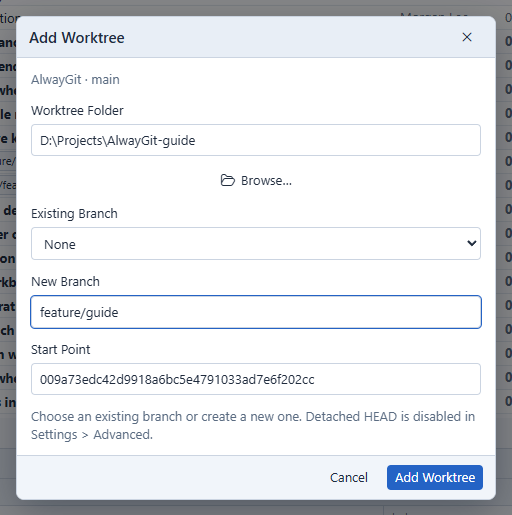

### Switch Worktrees or open one in a project window

1. A single click on a Worktree only selects it as the target for an operation. Double-click or press Enter to switch the current working directory.
2. Check the triangle marking the current Worktree, the branch, and the file status in Working Tree.
3. To edit in a separate VS Code project, right-click and choose Open Worktree in New Project Window.

**Result:** The workbench and editor window correspond to the correct directory, so changes are not mistaken for changes in another working directory.

**Caution:** Multiple Worktrees for the same repository appear as one logical repository entry, but their file statuses and Indexes are not combined.

### Remove a Worktree you no longer need

**Caution:** This removes the target Worktree's actual working directory. Forced removal can discard uncommitted files. It differs from removing a repository from AlwayGit navigation. The main directory, the current directory, and a locked state can all prevent removal.

**Prerequisite:** The target is neither the main Worktree nor the current Worktree, and its changes have been saved.

1. Switch to another working directory first.
2. Right-click the target Worktree and choose Remove Worktree….
3. Verify the directory, any reason for locking, and the confirmation message. Do not casually select Remove even with uncommitted changes to bypass protection for uncommitted content.
4. Click Remove Worktree. If a native Proceed confirmation appears, check the directory again before continuing.
5. After confirming, check the Worktrees list and the result on disk.

**Result:** The target Worktree's directory has been removed. The branch reference may remain and must be managed separately.

## Settings and Common Questions

### Set the language and display appearance

1. Click the gear in the upper-right corner to open settings.
2. Choose a page in the General, Interface, Commit Graph, or Advanced category.
3. Interface → Text & density controls the interface font size, list density, and file spacing. Interface → Diff groups the Diff font size, line height, and navigation scope with a code preview. Expand Detailed rules for navigation exceptions.
4. Click Apply to save. To discard unapplied changes, click Cancel, close settings, or press Esc.

**Result:** Applied settings take effect immediately. Cancel only rolls back previews that have not yet been applied.

**Caution:** The Simplified Chinese interface retains Git action names such as Stage, Commit, and Fetch. Paths, branch names, and Git errors remain in their original form.

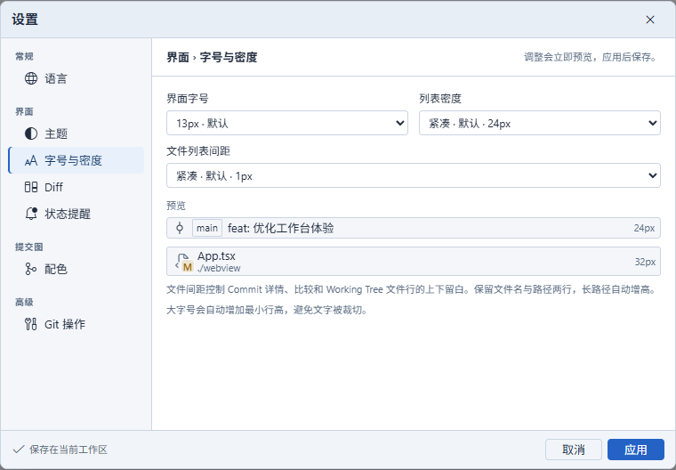

### Why will a file or native Diff not open?

**Prerequisite:** The error message is Trust the project workspace before opening it from AlwayGit, and you have verified that the project comes from a trusted source.

1. Switch to the VS Code project window for the target repository. It may already have been created but not brought to the front because the trust check failed.
2. If that window does not exist, use File → New Window, then File → Open Folder… to open the target repository directory.
3. In the target window, run Workspaces: Manage Workspace Trust or click Restricted Mode. Trust the project directory only after confirming that it is trustworthy.
4. Confirm that the target window uses the same Profile and has AlwayGit enabled, then return to the original workbench and reopen the editor or Diff.

**Result:** The native editor or Diff opens in the correct trusted project window.

**Caution:** Adding a repository to the AlwayGit repository list does not mean its directory is trusted. You do not need to trust all of a project's parent directories just to trust that project.

### Adjust and restore the layout

**Prerequisite:** You want to redistribute space among history, details, and Diff.

1. Drag the panel dividers to resize the left, right, and bottom areas.
2. Drag the visible boundaries of the Graph, author, and date columns to adjust their widths for easier reading.
3. Use the icons in the Diff title bar to collapse or restore the lower panel.
4. If the layout is unsuitable, click Restore Layout.

**Result:** The reading area suits the current task. Restore Layout restores the dimensions and the Diff expansion state.

**Caution:** Restore Layout does not clear the language, theme, or commit draft.

### Read error feedback before retrying

The results bar retains the operation name, target, and success or failure status. If an error occurs, first expand the full error, check the current repository and the in-progress operation bar, and then open the logs. After switching repositories, do not treat a result from another repository as the outcome of the current operation.

| Symptom | Check first | Next step |
| --- | --- | --- |
| A repository is selected in blue, but the content has not switched | Whether you only single-clicked to select the item | Double-click or press Enter, then check the current repository icon |
| Ordinary Commit is unavailable | Whether there are Staged files or conflicts | Check the staged scope and the operation bar; Amend can run without Staged files when only the message is changing |
| Switching branches is blocked | Files that might be overwritten and whether the branch is in use by a Worktree | Save your changes or open the Worktree using that branch |
| Push fails | The target, authentication, permissions, and whether the remote has advanced | Fetch and compare first, then address the error |
| Diff content is incomplete | Whether the file is binary, has encoding issues, or has a truncated preview | Use native Diff or the editor |
| The commit graph has no connecting lines | Whether a search is active or no references are checked | Clear the search or adjust the reference scope |

### Environment requirements and support boundaries

Basic functionality requires VS Code 1.95+ and Git 2.40+. Saving selected files in a Stash and isolated restoration with Apply / Pop require Git 2.43+. When using a remote host, also check the Git version on that host.

Git runs in the VS Code extension host where the repository resides. The product architecture is designed for local environments, WSL, Remote SSH, and Dev Containers; Git, paths, permissions, and authentication still need to be verified separately in each environment. Git is not executed in untrusted workspaces, and browser-only virtual workspaces are not supported.

Current scope: whole-file staging, standard Rebase, remote branch management, and explicit Tag Push. Not currently provided: hunk staging, interactive Rebase, commit reordering, Squash, Fixup, Format Patch, remote Tag deletion or replacement, or freely floating panels.

| Setting | Default or range | Description |
| --- | --- | --- |
| alwaygit.gitPath | Empty; machine scope | An explicit path takes precedence; otherwise, the path from the built-in Git extension or PATH is used |
| alwaygit.historyPageSize | 300; 50–1000 | Maximum number of actual Commits loaded per page |
| alwaygit.refreshInterval | 15 seconds; 5–300 seconds | Fallback refresh interval while the workbench is visible |
| alwaygit.allowDetachedHead | false | Advanced policy for entering Detached HEAD directly |
| alwaygit.pushFollowTags | false | Whether normal Push includes related annotated Tags by default |
| alwaygit.pushTagAfterCreate | false | Whether a new Tag is pushed to the selected Remote by default |
| alwaygit.defaultResetMode | mixed | Soft, Mixed, or Hard initially selected in the Reset dialog |
| alwaygit.language | en / zh-CN / auto | Initial language; the choice saved in the workbench takes precedence |

Reload the VS Code window after changing the Git path or refresh interval. Theme, color scheme, font size, density, and language settings within the workbench take effect immediately after you apply them.

## Quick Reference

### Selection and keyboard shortcuts

Single-key shortcuts are enabled by default throughout the focused AlwayGit workbench, including repositories, History, file lists, Diff, buttons and blank areas. Global shortcuts pause in text inputs, textareas, editable content, selectors, input-method composition, dialogs and context menus. When focus moves to a VS Code editor or terminal, that view handles the keyboard. Holding a key does not repeat an operation.

| Key | Action | Scope and behavior |
| --- | --- | --- |
| R; Ctrl/Cmd+R | Refresh | Refresh the repository currently open in the toolbar |
| F | Fetch | Same as the toolbar button |
| L | Pull | Open the Pull dialog |
| P | Push | Open the Push target confirmation |
| C | Prepare Commit | Open the Commit dialog and focus the message; does not submit |
| S | Stash All Changes | Open the dialog for saving all changes |
| W | View Working Tree | Inspect uncommitted changes without focusing a text input |
| H | Locate HEAD | Follow the existing HEAD location and history scope rules |
| O | Open repository folder | Open or switch to the current repository's VS Code window |
| D | Open Diff | Open native Diff for the current text preview; disabled for images and binary files |
| E | Edit file | Same as Edit in VS Code; text Commit comparisons open native Diff; disabled for images and binary files |
| [; ] | Previous; next change | Follow the Diff navigation scope; expand a collapsed Diff before navigating |
| \ | Minimize/expand Diff | Preserve the reading position |
| / | Search commits | Focus and select the Commit search text |
| , | Settings | Open Settings |
| ? (Shift+/) | Help | Open Help & Guide |
| A; U | Stage All; Unstage All | Working Tree only; confirm the entire group without a filter, or matching files with a filter |

Global actions target the currently open repository and preview file. Temporary sidebar selection and pointer hover do not change their targets. Disabled buttons have disabled shortcuts. A/U include all Unstaged/Staged files regardless of batch selection or collapsed groups; use the existing context menu for selected-file actions.

Hover over supported actions to see their keys. Settings → General → Keyboard shortcuts can disable single-key shortcuts. Apply saves the preference; Cancel restores it. Ctrl/Cmd+R and the existing selection controls below remain available. Drafts, repository selection and layout are preserved.

| Action | Meaning | Scope reminder |
| --- | --- | --- |
| Single-click a repository or Worktree | Select the target for an operation | Does not switch the current working directory |
| Double-click a repository or Worktree / Enter | Actually switch | Check the current item before and after the action |
| Check a reference | Change the Graph scope | Does not Checkout |
| Ctrl/Cmd + click | Add to or remove from a multiple selection | Right-clicking a selected item preserves that selection scope |
| Shift + click | Select a contiguous visible range | Collapsed directories affect the visible order |
| Ctrl/Cmd + A | Select all within the scope that currently has focus | In an input field, still selects all text |
| Escape | Clear the selection in the current scope or close a menu | Input fields retain their native behavior |
| Shift + F10 / Menu key | Open the current item's menu | Use the arrow keys to move and Enter to execute |
| Select exactly two Commits in History | Automatically Compare Commits | Working Tree is not included in Commit multiple selection |

### Common terms

| Term | Meaning here |
| --- | --- |
| HEAD | The currently checked-out version; usually points to the latest commit on the current branch |
| Index / Staged | The file contents prepared to be saved by the next Commit |
| Unstaged | Changes on disk relative to the Index that have not yet been staged |
| upstream | The remote branch tracked by a local branch |
| OID / Commit ID | A Git object identifier; a short hash is easier to read, while the full ID provides an exact reference |
| Detached HEAD | A commit is checked out directly, without being attached to an ordinary local branch |
| Merge Parent / Mainline Parent | A parent version of a merge commit; choosing a different parent changes the meaning of the comparison or the changes being taken |
| Worktree | Another working directory that shares the same repository's Git storage |

### Find an operation by goal

| What I want to do | Where to go |
| --- | --- |
| Save current file changes as a version | Working Tree → Stage → review Staged → Commit |
| Set changes aside to work on something else | Stash All Changes or Stash Selected Files |
| See what changed between two versions | Select exactly two Commits in History |
| Integrate all progress from another branch | Make the target branch current → right-click the source → Merge |
| Take only the changes from one commit | Make the target branch current → Commit menu → Cherry-pick |
| Undo the effects of a commit that has already been shared | Commit menu → Revert |
| Return to an older version and continue development | Old Commit → create a branch and switch to it |
| Synchronize new references from the server | Remote → Fetch |
| Send local commits to collaborators | Push → verify the target |
| Edit two branches at the same time | Worktrees → Add Worktree |

### Conventions used in this manual

Sample repositories, branches, and files are for demonstration. Actual project names, commit IDs, themes, and window sizes may differ. The instructions describe current behavior; the screenshot source is explained at the start of this manual. Verify the objects, counts, and scope shown by the current controls before executing an action.
